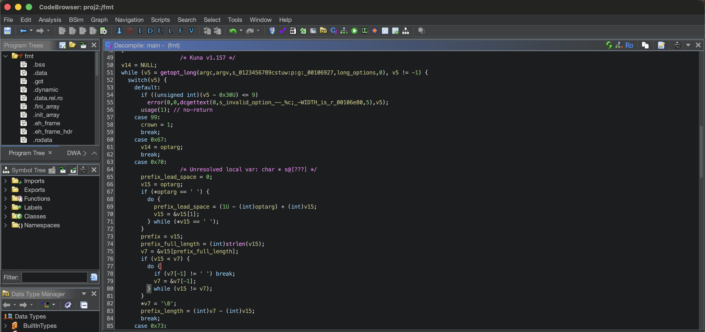

# Kuna

<p align="center">
   
</p>

An agent-first decompiler designed to be refined by other agents.
Kuna is written in Rust and was originally ported from [Ghidra](https://github.com/nationalsecurityagency/ghidra), but has since diverged on multiple features and pipeline designs.
This project is an _experiment_ to establish how far the autonomous refinement of decompilers can push research in the field.
Learn more about this approach in this [post](https://noelo.org/blog/kuna-release/).

**Questions? Join our Discord**:

[](https://discord.gg/vAQ8BKUPXv)

## Install & Usage
Kuna is distributed as a single Rust binary and can be run on most systems.
It can be used either on the [CLI](#cli-usage), the [web browser](#web-browser-usage), or in the [Ghidra GUI](#ghidra-gui-usage) (as the decompiler backend).

### CLI Usage

#### Installation
- **Pre-built Binaries**: Download the latest release for your OS (Linux, Windows, macOS) from [releases](https://github.com/Noelo-Lab/kuna/releases).
- **Arch Linux (AUR)**: Install directly from the AUR using your favorite AUR helper:
  ```bash
  yay -S kuna
  # or
  paru -S kuna
  ```
- **Building from Source**: Build the `kuna` binary in `decompiler/target/release/kuna` (see [Building from Source](#building-from-source)).

#### Examples

```bash
kuna decompile ./a.out main
kuna decompile ./stripped.bin 0x401040 --addr
# decompiles a full binary, returning a .c, .h, and .asm file
kuna decompile-project ./a.out
# flip a feature internal to the decompiler (useful for LLMs)
kuna decompile ./a.out main --option compareform canonical
``` 

LLM agents should utilize the `./docs/options.md` file, which will inform them about the features which can be toggled in run-time associated with situations they may be helpful.
If bugs are found during usage, please report them with an issue.

### Web Browser Usage
Since Kuna is written in Rust, you can also use it in the web browser through WebAssembly.
This will do all of the work on your machine, which means the binary remains private.

Visit [kuna.noelo.org/decompile](https://kuna.noelo.org/decompile) to use it.

The code for deploying your own site can be found in `./integrations/web`

### Ghidra GUI Usage
Since Kuna is originally a Ghidra port, the output format has remained largely compatible with Ghidra proper.
You can use the Kuna core as the Ghidra decompiler inside of the traditional Ghidra GUI.
You can either build the extension (`./integrations/ghidra`), or download the extension for the latest release.

The extension will work on all platforms Kuna is supported on.
To install and activate Kuna in Ghidra, do the following:
1. Download it from the [releases](https://github.com/Noelo-Lab/kuna/releases/download/v1.157/kuna-v1.157-KunaDecompiler-ghidra_12.1.2.zip) , named `kuna-version-KunaDecompiler-ghidra....zip`.
2. In Ghidra: File → Install Extensions… → + → select the zip → restart.
3. In Ghidra: File → Configure → Miscellaneous → check KunaDecompilerPlugin.

Now, when you decompile, you should see `/* Kuna v{version} */` in the decompilation.



All native Ghidra features are not yet supported, so please report them when you find issues.
To disable the Kuna backend, simply disable the plugin in `File -> Configure`.

## Project Goals

LLM agents, like [Codex](https://chatgpt.com/codex/), have fundamentally changed how we reverse engineer and ultimately secure binaries.
Instead of humans looking directly at decompilers, LLMs are increasingly the ones using them, and humans instead read the agents' logs.
As such, it feels natural that decompilers should become oriented and optimized around agents.
Additionally, we can use those agents to automatically refine the tool they depend on.

Although agents should write most of the code in this project, insight into what should be written an how it should be designed is still needed at times.
This project takes two main stances on pipeline design and feature design based on other decompilers that have shown success.

In total, this projects aims for the following goals:

1. **Autonomous refinement**: we must design datasets, prompts, and tools for LLMs to continue to improve the decompiler while we are sleeping. This improvement should be based on science, and, ideally, solid metrics. Currently, [DecBench](https://decbench.com/) serves to facilitate the data and metrics needed for refinement. 
2. **Agent-first**: we muse prioritize the quality of the decompilation text over other (normally important) aspects of decompilers, like GUIs or visualization tools. This also means we should strike a balance between features and speed, since the bottleneck on big binaries will be the decompiler. Additionally, we will explore optimal ways to give LLMs access to the decompiler.
3. **Tunable**: when we instruct our LLMs to develop new features, either through human involvement or automation, we should make these features toggalable and configurable for different context. As an example, reversers may want high-level code, while pwners want low-level code. This discrepancy means uses have different goals of decompilation, and our feature implementation style should match that.

## Design

On the engineering side, the decompiler design aims to align with two other aspects:

1. **Phase based**: each phase of the decompiler should be well defined to give LLMs a better chance at finding features and code when they need to make changes. This also makes it easier to debug and improve.
2. **Natural language spec**: every impactful feature and algorithm should be described, at least in part, in the natural language specification of the decompiler (`./docs/spec`). This is closely aligned with the stage-based model, and should provide a way for humans to audit high-level ideas in the decompiler. 

The phases are described in the following files:
- `docs/phases.md` — the stage model at a glance (the runtime registry is queryable via the `stage list/map/catalog` console commands).
- `docs/options.md` — the tiered option catalog (transforms = the LLM control surface,
  with a generated symptom index)

## Development

The majority of code analysis and creation is expected to be done with frontier LLMs in an agentic framework like Codex or Claude Code.
The agent-facing guidance lives in [`AGENTS.md`](AGENTS.md) (a symlink to `docs/agents.md`), which holds the enforced rules for contributing features and a doc map to everything else.

### Building from Source
You only need a **Rust toolchain** (`cargo`).

```bash
make binaries   # cargo-build the decompiler (decomp_dbg, decomp_test_dbg),
                # the SLEIGH compiler (slacomp), and the `kuna` CLI
make specs      # compile every SLEIGH .slaspec -> .sla with slacomp (the decoder needs these)
make            # = binaries + specs
```

Everything lands in `decompiler/target/release/`. For development, work in the cargo workspace
directly: `cd decompiler && cargo build` / `cargo test --workspace`.

### Test
Four gates, all expected green before every commit:

```bash
make test        # the 675/675 decompiler regression parity (tests/datatests/ vs docs/baseline.json)
make test-stages # the kuna-owned issue testcases (tests/stages/ vs docs/baseline-stages.json)
make rust-test   # the full cargo workspace suite (ported unit tests, golden differential
                 # vectors, SLEIGH-compiler .sla content-parity, docs/options.md freshness, ...)
make check-spec  # docs/spec/ honesty: anchors and inline code paths resolve, and each
                 # phase folder is owned by exactly one spec chapter
```

`make test` compiles the specs with the Rust SLEIGH compiler and decodes the XML regression
corpus (`tests/datatests/`, 83 files / 675 assertions) with the Rust decompiler.

### Layout

| Path | What it is |
|---|---|
| `decompiler/` | The engine — a cargo workspace. `kuna-decomp` (the decompiler, phase-foldered `p0_knowledge/`…`p9_emit/`), `kuna-analysis` (the loader/analyzer tier), `kuna-sleigh`/`kuna-slacomp` (SLEIGH runtime + compiler, binary `slacomp`), `kuna-console` (the `decomp_dbg`/`decomp_test_dbg` binaries), `kuna-cli` (the `kuna` binary), `kuna-ghidra`/`kuna-wasm` (the Ghidra and browser front-ends), plus support crates |
| `tests/datatests/` | Upstream XML decompilation regression tests (83 files → 675 assertions); the corpus `make test` runs |
| `tests/stages/` | kuna-owned issue testcases; the corpus `make test-stages` runs |
| `tests/golden/` | Differential golden vectors for the workspace suite (`make rust-test`) |
| `specs/Ghidra/Processors/` | Vendored SLEIGH processor specs; `.sla` are build artifacts produced by `slacomp` |
| `integrations/` | Front-ends embedding the engine: `ghidra/` (kuna as stock Ghidra's decompiler core) and `web/` (the project site + in-browser decompiler) |
| `scripts/` + `tools/` | Python helpers and drivers for the improvement pipeline (`docs/improvement-pipeline.md`) and the decbench campaign (`docs/decbench-loop.md`) |
| `Makefile` | Top-level build/test driver (Rust-only) |
| `docs/history.md` | The project history, incl. the C++→Rust port and its validation |

## License

kuna is released under the [Apache License 2.0](LICENSE). It is derived from
[Ghidra](https://github.com/NationalSecurityAgency/ghidra), developed at the National
Security Agency and released under Apache-2.0 — see [NOTICE](NOTICE) for attribution
(including the angr-ported portions, BSD-2-Clause).
