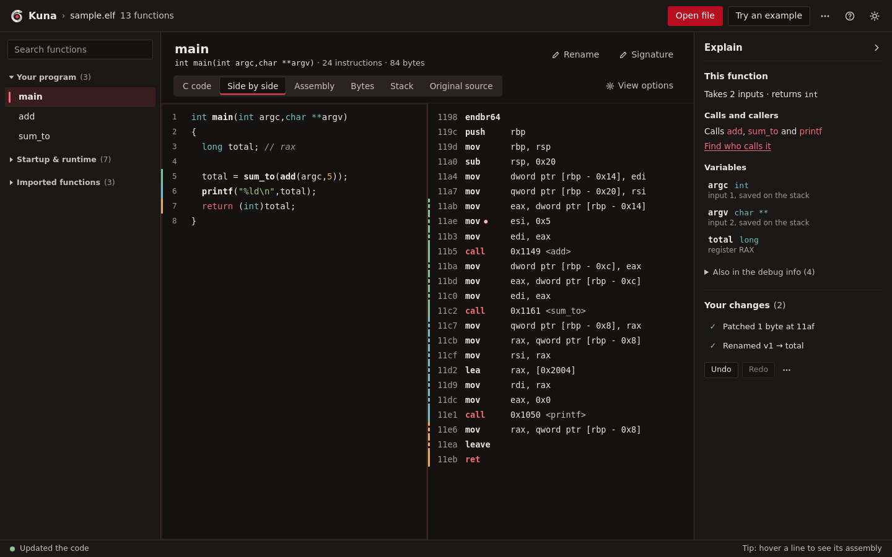

# Running kuna in the browser (WebAssembly)

How kuna decompiles **entirely client-side in a web browser** — the target choice, the
one seam that makes it work, the virtual-filesystem mapping, the build, and the tests.
Audience: kuna developers extending or maintaining the web front-end. The practical
"build and serve it" guide is `integrations/web/README.md`.

This is a genuine in-browser decompiler: the engine runs in a module Worker as
WebAssembly. Nothing is uploaded and no server participates in decompilation. A WASI
runtime implemented in JavaScript hosts the module; the browser is the whole stack. The
Worker keeps synchronous `wasi.start()` calls off the UI thread.

---

## 1. The decision: WASI, not a rewrite

The engine touches the outside world through an unusually thin surface:

- **no threads, no `rayon`** anywhere in the pipeline;
- the only subprocess calls are in the *CLI* layer (`kuna` spawning `decomp_dbg`) or are
  **test-only** (the hermetic `go build` in `kuna-analysis`'s no-return test) — none in
  the engine;
- engine wall-clock (`Instant::now()`) is reached only when a per-function
  watchdog is armed; fast whole-binary `decompile`/`project` commands arm the
  shared 10-second budget and the browser WASI clock supplies it;
- everything the decompiler loads — the target binary (via `LoadImage`) and the SLEIGH
  `.sla`/`.pspec`/`.cspec`/`.ldefs` (via `scan_language_database`) — arrives through plain
  `std::fs` **path reads**.

Those path reads are the key. **WASI** (`wasm32-wasip1`) gives a wasm module a POSIX-ish
filesystem backed by *preopened* directories, which a JS host can populate from memory.
So the engine's `std::fs::read(specfile)` / `std::fs::read(binary)` calls work **unchanged**
against a virtual filesystem the page assembles. The result: the full engine + analysis
stack (`kuna-base` · `kuna-num` · `kuna-sleigh` · `kuna-decomp` · `kuna-analysis` ·
`kuna-console`) and every dependency (`object`, `gimli`, `pdb`, the demanglers, `flate2`,
`smallvec`, `slotmap`) compiles to `wasm32-wasip1` with **zero source changes**.

The rejected alternative — `wasm32-unknown-unknown` + `wasm-bindgen` — gives a cleaner
JS-native API but has no filesystem, so it would require refactoring the engine's
spec-load and image-load reads to take byte buffers. That is real engine surgery for a
cosmetic API gain; WASI keeps the engine untouched, which is the whole point ("don't break
kuna"). A `wasm-bindgen` reactor front-end can be added *later* as an optimization (see §7)
without disturbing the WASI path.

## 2. Shape: a front-end crate + a browser harness

```
decompiler/crates/kuna-wasm/     the wasm (and native) binary: `kuna_wasm`
integrations/web/                the project site + browser harness (assembles a static dist/)
```

The deployed site has a **landing page** at `/`, a repository-derived **development
visualization** at `/dev-viz/`, and the **decompiler application** at `/decompile/` (§4.1).
Only the last one loads the wasm; everything below describes it.

`kuna-wasm` is a **purely additive leaf crate**. It depends only on existing engine crates
(`kuna-console`, `kuna-decomp`, `kuna-base`) and the already-present `object`; it adds no
new external dependency or wasm-only stage-model option. Like the native file
front-ends, it resolves the default `auto` mode from the input byte length and
uses the core `fast_funcdisc` option for rooted whole-image inventory recovery
with conservative pointer validation.
`make binaries` builds a
fixed crate list that does not include it, and
`check_spec.py` only scans `kuna-decomp`/`kuna-analysis`, so the only gate that touches it
is `make rust-test` (`cargo test --workspace`), which compiles it natively and
runs its frontend tests.

`kuna_wasm` runs `kuna decompile-all`'s core loop via the **shared decompile-project
core** — `kuna_console::project` (`decompile_targets` + the `.c`/`.h`/`.asm`/`README.md`
artifact builders, moved there from `kuna-cli` so wasm32-wasip1 can reach them without
`kuna-cli`'s subprocess/CLI machinery, which cannot compile for wasm). It reuses the
*exact* engine entry points:

```
metadata(binary).len() → auto_mode_for_size(...) // <500 KiB aggressive; <2 MiB reliable; else fast
  → bootstrap_from_object(binary, "", [spec_root])   // load image + resolve arch + build translator
  → apply concrete mode + command-scoped discovery policy + non-conflicting driver injections
  → commit_pending_analysis()                                   // the `read symbols` seam
  → kuna_console::project::decompile_targets(...)  // the same loop kuna decompile-all runs
```

Its `--json` is `kuna decompile-all --json`'s fields (`name`, `address`, `address_hex`,
`aliases`, `size`, `code`, `error`, `unstructured_gotos`,
`variables[{name,type,kind,arg_index,stack_offset,size}]`)
— including the one-record-per-entry contract and the `aliases` array documented in
`docs/cli.md`. Wasm `list` reports the full canonical callable-symbol inventory
under the selected mode. In `fast`, that inventory includes the bounded Listing's
direct-call closure and validated absolute pointer-table roots, not just loader
metadata.

**Every command shares one discovery policy — `list` included** (DIV-53). All three
commands apply the same `decompile-all` driver injections (`listing`, plus
`funcstart_patterns` and `aif` on a non-x86-64 target, each skipped when the selected mode
names that option), so the browser inventory is exactly the target set the `project`
export decompiles. This is where the wasm front-end deliberately diverges from `kuna
functions`, which keeps enumeration cheap: in the browser the sidebar is the *only* way to
reach a function, so an entry the inventory omits is a function the UI cannot open at all
— not a saved analysis. The window that matters is `reliable` (500 KiB–<2 MiB), the one
mode with no discovery overrides of its own; `aggressive` already turns all three on and
`fast` turns all three off, so those two were consistent before and after.

**Output language.** The **Language** control alongside **Mode** carries the same three
choices the CLI does: `auto` (the default), `C`, and `Rust`. `auto` follows the binary —
a Rust binary renders as Rust (DIV-80) — and, exactly like `auto` mode, it is resolved by
the ENGINE rather than by JavaScript: `kuna-web.js` passes the literal `auto` through as
`--language auto` and `kuna_wasm::resolve_language` decides. Nothing sniffs the binary in
the browser, so the browser and the CLI cannot drift apart on the policy. `project` is
excluded on both sides (its `.c`/`.h`/`.asm` export is C-shaped end to end), and the
syntax highlighter picks its dialect from the returned text, since the caller asked for
`auto` and only the engine knows what it resolved to.

That makes the mode a *product* decision in the browser, not just a speed dial, so the
page exposes it: a **Mode** control beside the file picker (`auto` — the default — plus
`fast` / `reliable` / `aggressive`), whose value is passed to `kuna.load` and carried by
the Worker session to `list`, `decompile` and `project` alike. Changing it re-indexes the
binary already loaded, because the mode changes the inventory itself and a sidebar that
disagrees with the bodies below it would be worse than either. Without the control a
binary at or above 2 MiB was pinned to `fast` with no way to ask for more: on a 3.4 MB
i386 PE the browser listed **3,495** functions where `reliable` finds **14,014** (IDA Pro
finds 14,576), and the page held the only copy of the uploaded bytes, so there was nowhere
else to go.

Unfiltered `decompile` and `project` use the shared CODE-backed target set, while
explicit address decompile suppresses that whole-image discovery pass and
reaches the requested entry directly. Name selection keeps discovery active so
a generated `sub_<addr>` name can resolve, then exports only the selected
function. This is the same selector/inventory split as the native front-end:
selecting one function does not silently export its discovered call closure.
The output adds one per-function field the native `decompile-all --json` does not
carry: `"kind"` —
`"func"` | `"plt"` | `"thunk"`
(`kuna-console/src/classify.rs`, shared with `kuna decompile-graph`: an `object`-crate
re-parse marks entries inside import-stub
sections — the `.plt` family, Mach-O symbol stubs — or named as imports as `"plt"`, and
lone-jump entries (`ConsoleProgram::lone_jump_target`, direct-to-another-function or
indirect) as `"thunk"`; the UI folds those below a divider). CLI:

```
kuna_wasm <binary> <spec-root> list [--mode MODE]
kuna_wasm <binary> <spec-root> decompile [name|0xADDR] [--mode MODE]
kuna_wasm <binary> <spec-root> project [<display-name>] [--mode MODE]
```

`project` is the `kuna decompile-project` flow with the folder write replaced by one JSON
document — `{binary, name, count, ok, failed, files:{"<name>.c", "<name>.h", "<name>.asm",
"README.md"}}` (artifacts named after `<display-name>`, default the binary's basename;
whole binary only). Omitted mode and explicit `--mode auto` use the shared
native/browser policy: `<500 KiB` selects `aggressive`, `500 KiB–<2 MiB`
selects `reliable`, and `>=2 MiB` selects `fast`. Because `project` is
whole-binary only, the fast selection runs `fast_funcdisc`: the downloaded C/H
inventory contains directly reached and validated indirect-only internal
functions while the exhaustive prologue and AIF scans remain off. The page's
**Download Binary Source** button runs it and zips the four artifacts inside the module
Worker (`integrations/web/zip.js`, a dependency-free STORE zip writer). Only the final ZIP
`ArrayBuffer` is transferred to the main thread. Two things differ from the CLI export.
The README's `Path` row shows the display name instead of a canonicalized host path
(there is none in the virtual FS). And the decompile order is address order: the
callee-first schedule a serial `kuna decompile-project` takes lives in the `kuna-cli`
driver (`--option protoorder`, `docs/cli.md`), while this command calls the shared eager
batch directly, so the browser's call-argument types and `struct_N` numbering are the
ones `--option protoorder off` produces.

**The study view's commands: `inspect`, `read`, `xrefs`, and `--assert`.** Every command also
takes a repeatable `--assert <directive>` — the CLI's override plane, parsed by the same
grammar (`kuna_console::assertsyntax`, one directive per value; a value with a line break
is refused) and applied in the CLI's order (read-only propagation when a `readonly` range
implies it, `set_assertions` + the image-scoped directives before the analysis commit, the
program-scoped ones after it, the function- and symbol-scoped ones inside the decompile
loop). Three more commands serve the study view:

```
kuna_wasm <binary> <spec-root> inspect <name|0xADDR> [--mode M] [--language L] [--assert D]...
kuna_wasm <binary> <spec-root> read <0xADDR> <LEN> [--assert D]...
kuna_wasm <binary> <spec-root> xrefs <name|0xADDR> [--mode M] [--assert D]...
```

Because every request is a fresh process, the page's edit session IS its directive list: it
resends the list on every call, and the same list replays natively as `kuna decompile
<bin> <fn> --assert @file`. What becomes of each directive is an `assertions` row —
`{directive, kind, phase, subphase, status, detail, fatal}`, the `decompile-all --json`
report — on every document (`list`, `decompile`, `inspect`, `read`, `project`). A directive
that binds to nothing is a `rejected` row and the command still exits 0 with its payload;
a directive that does not parse is the run's error (`error: --assert "<directive>": <why>`
on stderr, nonzero exit). What the page sends: for `inspect`, the program-wide directives
plus that function's own **unqualified** (`name v1 total`); qualify with the function's
*current* name (`name entry_main::v1 total`), never an address. A function rename is
`function 0xENTRY=<name>` — the inventory then lists `<name>` with the old names in
`aliases`, the new name selects it, and directives may be qualified with it. Parameters
retype and rename through `prototype 0xENTRY <C declaration>`; a global is `data 0xADDR
<type> <name>`; a byte patch is `bytes 0xADDR <hex>` (every later decode and `read` sees it).

`inspect` is one load and one function — the same batch `decompile <selector>` runs (with
its structure-naming convergence), so its `code` is `decompile`'s byte for byte; like
`decompile`, a name keeps the discovery walk on and an address skips `fast_funcdisc`.
Compact JSON, every address a number plus an `_hex` twin:

```
{binary, language, target:{archid, processor, endian, bits},
 function:{name, address, address_hex, aliases, object_location, kind, size,
   code, error, proto, unstructured_gotos,
   line_mappings:[{line_number, addresses, addresses_hex}],
   variables:[{name, type, kind:"arg"|"stack", arg_index, stack_offset, size,
               line_numbers, addresses, addresses_hex}],
   types:[{name, definition, size}],
   globals:[{name, address, address_hex, declaration, size}],
   tokens:[{line, col, len, kind, color, text,
            address?, address_hex?, callee?, callee_hex?, var?, decl?, type?}],
   tokens_error: null | string,
   instructions:[{address, address_hex, offset, size, bytes, mnemonic, operands, text,
                  file_offset, lines}],
   instructions_truncated},
 assertions:[…]}
```

`tokens` is the token source map (`docs/spec/09-emission.md` §9.2): `line` is 1-based in
`code`, `col`/`len` are UTF-16 code units, and on each line the tokens' texts joined with
the gaps as spaces rebuild that line exactly (the engine verifies it before shipping; on
failure `tokens` is `[]` and `tokens_error` says why). `kind` is `syntax`, `variable`,
`value` (literals and case labels), `op`, `funcname`, `type`, `field`, `comment` or
`label`; `color` is the printer's highlight class (`keyword`, `comment`, `type`,
`funcname`, `var`, `const`, `param`, `global`, `none`, `error`, `special`). Optional
members appear only when known: `address` is the instruction the token stands for (a
comment's or label's own address in the code space), `callee` the entry a call's name
names, `var` an index into `variables` (register-only locals have no row), `decl` is
`local`, `param`, `return` or `function` inside a declaration, and `type` names the type
of a `type` token or the aggregate of a `field`. `instructions` is the `kuna disassemble
--follow` walk over the function's extent (`kuna_console::disasm`, the CLI's own walker:
branch targets start rows, literal pools fold to `.word`, undecodable bytes are `.byte`),
at most 4096 rows (`instructions_truncated`); `bytes` is lowercase hex and honours `bytes`
overlays, `offset` is `address − entry`, `file_offset` is where the instruction sits in the
input file (`null` outside file-backed sections), and `lines` (always present, `[]` when
none) are the `code` lines whose `line_mappings` name the instruction. The line mappings
are sparse — a line maps to the instructions whose p-code its tokens were printed from, so
argument set-up that was folded away maps to nothing.

`read <0xADDR> <LEN>` returns `{binary, address, address_hex, size, bytes, file_offset,
assertions}`: up to 64 KiB, stopping where the mapped run holding the address ends (the
loader would zero-fill past it; an unmapped start is `size: 0`, not an error), overlays
applied, loaded with the discovery walk off. `xrefs <name|0xADDR>` answers from `kuna xrefs`' reference walk
(`kuna_analysis::listing::xrefs`, seeded with the inventory and focused on the function):
`{binary, function:{name, address, address_hex}, callers:[{name, address, address_hex,
from, from_hex, kind, instruction}], callees:[{name, address, address_hex, at, at_hex,
kind, instruction}], data_refs:[…as callees…], assertions}` — a caller's `address` is the
calling function's entry and `from` the calling instruction; callees are calls and jumps
that leave the function (`kind` `call`/`jump`), data refs are `data` (address taken),
`read` and `write`; all three lists are in instruction order. `list` adds `language`, `target`, `sections:[{name, address, address_hex, size,
file_offset, file_size, executable, writable}]` (allocated sections, in address order;
`file_size` is how many of the section's bytes the file holds from `file_offset`, which a
PE section's virtual size can exceed; `writable` follows the segment that maps the
section) and `known_types:[{name, size, kind}]` (the
factory's named non-core types: `struct`, `union`, `enum`, `typedef`, `scalar`), and
`decompile` adds the top-level `language` and the per-function `line_mappings`, `types`
and per-variable `line_numbers`/`addresses` of `kuna decompile-all --json`. The line
evidence costs a second render per function, so only a one-function `decompile` pays for
it; the whole-binary `decompile` carries the fields empty (`inspect` always has them).

## 3. The virtual filesystem (the whole trick)

`integrations/web/kuna-worker.js` calls `integrations/web/kuna-web.js`, which drives
[`@bjorn3/browser_wasi_shim`](https://github.com/bjorn3/browser_wasi_shim)
(vendored under `integrations/web/vendor/`, pinned in `VERSION`), a pure-JS WASI
**preview1** implementation. For each decompile it builds a fresh instance with two
preopened directories:

| Preopen | Guest path | Contents |
|---|---|---|
| specs | `/specs` | the SLEIGH tree — all the small runtime files preloaded, plus each `.sla` added as it's lazily fetched (`File` inodes reused across runs) |
| work | `/work` | `input.bin` — the user's uploaded bytes |

then runs `kuna_wasm /work/input.bin /specs decompile --mode auto` with `stdout` captured via
`ConsoleStdout.lineBuffered`. The captured stdout is the JSON the UI renders. This is the
same preopen model Node's `node:wasi` uses — the parity test (`test/parity.mjs`) drives
the identical wasm through `node:wasi`, and the glue test (`test/glue.mjs`) drives it
through the real browser shim; both must agree with native.

The page and Worker communicate through `kuna-worker-client.js`:

```
upload bytes → Worker `list` → address-only rows
click row    → Worker `decompile 0xADDR` → one C body                    (/decompile)
open fn      → Worker `inspect 0xADDR --assert …` → C, tokens, rows      (/decompile2)
edit         → one more directive → Worker `inspect` again, old render kept up
download     → Worker `project` → Worker `makeZip` → transferred ArrayBuffer
cancel       → terminate Worker → create Worker → rehydrate binary on next request
```

Function bodies are cached by address in the page after the first click. Inventory,
one-function decompilation, and project export all retain `--mode auto`, so the Rust
front-end remains the source of truth for the 500 KiB and 2 MiB thresholds.

The Worker session carries the binary, the mode **and the output language** to every
request. Until the study view was added, `setBinary` stored only the mode, so the
`/decompile` page's Language control never reached the engine; `test/worker.mjs` now
loads with `rust` and asserts Rust comes back. Every Worker method (`list`, `decompile`,
`inspect`, `read`, `xrefs`, `project`) also takes an `assertions` list, which
`wasmCommandArgs` appends as one `--assert <directive>` pair each, after the mode and
language; an empty list produces exactly the argv the flag's absence always did
(`test/auto-mode.mjs` pins both). A failed request keeps what the engine said: the error
reply carries `detail` (`exitCode`, `stderr`, and the stdout JSON when it parses), which
the client exposes as `error.detail`.

The study view holds a student's edits as that directive list (§2) and re-inspects the
open function after each edit (§4.2).

Termination is intentional. WASI execution is synchronous after `wasi.start()` enters
WebAssembly, so an ordinary cancel message cannot be handled until that call returns.
`Worker.terminate()` is the browser primitive that can stop it while leaving the UI
responsive. The client rejects every in-flight RPC with `KunaWorkerCancelledError`,
creates a clean Worker, and keeps the uploaded bytes on the page side solely to restore
the session for the next request.

If the Worker script is blocked before initialization (for example by a content-blocker
rule or a browser privacy setting), the client reports that startup failure separately
with the blocked path and instructions to allow the site and reload. The failed Worker is
terminated, and later RPCs reject with the same error instead of waiting forever on a
worker that cannot answer.

**Robust, format-agnostic specs (whatever the CLI supports).** The demo carries
**no per-format or per-arch logic** — the *engine* detects the format
(ELF/PE/Mach-O/COFF) and resolves the SLEIGH language for any binary, exactly as
`kuna decompile-all` does. Two facts make a lightweight lazy scheme possible:

- The decompiler reads only the **runtime** spec files — `.ldefs` + `.pspec` +
  `.cspec` + `.dwarf` (not the `.sinc`/`.slaspec` SLEIGH *source*). Those total
  just **~1.7 MB (~180 KB gzipped)** across the whole tree, so `build.sh` bundles
  them into `specs-small.json`, which `kuna-web.js` preloads once. With them
  present, `scan_language_database` can resolve **any** binary.
- The one heavy per-language file — the **`.sla`** (~475 KB) — is the only thing
  fetched per binary. When it's absent the engine fails with
  `Could not find .sla file for <language-id>`; `kuna-web.js` maps that id → its
  `.sla` (via the `slafile=` in the ldefs it already holds), fetches it from the
  server, and retries. Fetched `.sla` are cached across decompiles.

So the browser downloads the ~180 KB bundle once, then ~475 KB per distinct
language — and supports every format/architecture kuna has a `.sla` for, with the
engine as the single source of truth (no `e_machine` parsing, no arch manifest).
Verified end to end here: ELF (x86-64, AArch64) and Mach-O `native == wasm ==
browser`, and a real PE executable (152 functions) through the browser lazy path.

## 4. Build & payload

`integrations/web/build.sh` builds `kuna_wasm.wasm` for `wasm32-wasip1`, applies
`wasm-opt -Oz` if available, and assembles a self-contained `integrations/web/dist/`:
the site + glue + vendored shim + wasm, the **full runtime SLEIGH tree** under `specs/`
(every `.ldefs`/`.pspec`/`.cspec`/`.dwarf`/`.sla` — ~15 MB static, lazily fetched), and
the `specs-small.json` preload bundle. Serve `dist/` with any static file server.

### 4.1 The site layout

```
/                     index.html          landing page: hero, compare, goals
/dev-viz/             dev-viz/index.html development record: cadence, phases, provenance, evidence
/decompile/           decompile/index.html the decompiler application (loads the wasm)
/decompile2/          decompile2/          the study view: linked C/assembly/bytes, edits (loads the wasm)
/decompile2/examples/ sample.elf, sample.c the "Try an example" program and its source (copied by build.sh)
/assets/              css/site.css · fonts/ · img/ · js/highlight-c.js · js/fnfilter.js
/compare-samples.js   the compare section's data (samples + rival outputs)
/CNAME                kuna.noelo.org — the custom domain, copied into the bundle
/kuna-web.js /kuna-worker.js /kuna-worker-client.js /zip.js
/kuna_wasm.wasm /specs/ /specs-small.json /vendor/
```

The engine-facing files stay at the **root** — `/decompile/` and `/decompile2/` reach them with `../`, so
the Worker is a sibling of `kuna-web.js`/`zip.js`, the existing tests can import the glue
directly, and a project subpath still works. The RPC client resolves the wasm/spec URLs
against the document before sending them to the Worker; resolving those `../` paths in
the root-level Worker would otherwise escape a GitHub Pages project subpath.

**The sidebar filter.** A whole-binary inventory is thousands of rows (the 1.1 MiB PE in
DIV-53 indexes 3,158), and the sidebar is the only way to reach a function, so the list is
filterable: `/` from anywhere focuses the box, typing narrows the list live, `Enter` opens
the first match, `Escape` clears, and the arrow keys walk the visible rows. A query is
either whitespace-separated terms — ALL of which must appear in a row's name, one of its
aliases, or its address, case-insensitively, so `sub_4e6` and `4e68` and `_dws` all work on
a stripped binary — or a `/regex/flags` literal (case-insensitive unless it names flags; an
unparseable one flags the box and reports the error instead of silently emptying the list).
The header and the `imports & thunks` divider switch to `matched of total` while a filter
is live. The matcher and both count strings are `assets/js/fnfilter.js`, kept DOM-free so
`test/fnfilter.mjs` can pin them under Node (§5); the page owns only row visibility and
focus. `/decompile2/` uses the same matcher over its grouped list (§4.2). Filtering is a single pass over precomputed per-row haystacks — 1.8–3.0 ms per
keystroke over 3,158 rows in Chrome — and the inventory is built into one
`DocumentFragment` so a multi-thousand-row list reflows the sidebar once, not per row.

The landing page and `/decompile/` share the Noelo Lab site's palette and typefaces
(`noelo.org`, BSD-2-Clause; provenance note at the top of `assets/css/site.css`) but not
its layout: they are tool pages — one display line, then monospace throughout, small
red-ticked section labels instead of a lab-page rail. One stylesheet serves those two
(`/decompile2/` has its own stylesheet on the same palette, dark by default, §4.2); `assets/js/highlight-c.js` is
the single C highlighter shared by the compare panes and the function view. The landing
page is otherwise inert — no wasm, no network — and `compare-samples.js` is pure data, so
adding a comparison is a data edit (its header documents the schema; every pane must be
verbatim tool output).

The samples are **mined, not chosen by hand**: `python3 -m scripts.decbench.showcase` reads
the DecBench results tree for optimized, medium-sized functions where kuna out-scores IDA
and no rival out-scores kuna, dumps all five panes plus the original source per candidate,
and re-decompiles each one with the current build (`--verify`) so a shipped pane is still
byte-for-byte what kuna prints today. Every sample carries the measured GED for the pair on
screen (`ged:` in the sample, rendered under the dropdowns). A mined candidate is never
shipped unread — the selection procedure, including what disqualifies a sample, is
`docs/decbench-loop.md` → *Finding good kuna examples*.

The section shows **provenance and the measured score, and nothing else** — no captions,
and a neutral dropdown label (`fn() — project binary, arch`); the reader draws their own
conclusion from the two panes. The right pane defaults to IDA. The one display-only
normalization is in `index.html`'s `tightenHeader`: kuna and Ghidra both print a blank line
between a function's signature and its opening brace, and it is collapsed so the panes
start level. It is whitespace, and only before a column-0 `{` — the committed data stays
byte-verbatim, which is what `--verify` checks against.

**Hosting on GitHub Pages.** `.github/workflows/pages.yml` runs this same build in CI
(stable Rust + `wasm32-wasip1`, `binaryen` for `wasm-opt`, `make specs` to compile the
whole `.sla` tree) and deploys `dist/` via `actions/deploy-pages`. All asset references are
relative, so it serves correctly either from the custom domain or from a project subpath
(`https://<owner>.github.io/<repo>/`); no COOP/COEP headers are needed (no threads /
SharedArrayBuffer). Enable once under *Settings → Pages → Source = GitHub Actions*.

The site is **`kuna.noelo.org`**: `integrations/web/CNAME` is copied into the bundle by
`build.sh`, and DNS points that name at GitHub Pages. With the Actions deploy flow the
repo's *Settings → Pages → Custom domain* field is the authoritative half — set it there
too, or the CNAME file alone may not claim the name.

Payload: **~1.7 MB** wasm (gzipped, shared) + a **~180 KB** gzipped spec bundle once, then
**~475 KB** per distinct language (`.sla`, fetched on demand and cached). The ~15 MB of
`.sla` sit on the server; only what a binary actually resolves to transfers. Cold decompile
of a small binary is sub-second (≈0.45 s measured in Node `node:wasi` and in headless
Chrome on the committed fixtures).

### 4.2 The study view (`/decompile2/`)

A second application page for students: one function as **C, assembly, bytes and its
stack frame, linked**, with renames, retypes, prototypes, comments and byte patches that
the engine applies. `/decompile/` is unchanged.

It is written for someone who has never used a decompiler, so it is laid out like an
app: full screen, with its own stylesheet (`decompile2/decompile2.css`). The colours are
the Noelo palette of the rest of the site, dark by default — Noelo's dark footer (warm
near-black ink, warm greys, the mark's red for the accent and the primary button, flat
1px rules, near-square corners) stretched to a whole app — and the toggle switches to
Noelo's light paper, where the primary button is ink. The type is the app's own: a
system UI font, monospace only for code, no uppercase labels. Every text colour passes
WCAG AA 4.5:1 on each background it sits on. Labels are plain sentence-case words ("C
code", "Side by side", "Explain", "Your changes"), and whatever a beginner does not need
at first sight is off by default or one click away.

```
| Kuna › sample.elf  13 functions               [Open file] [Try an example]  ⋯  ?  ☾   |
|--------------------|-----------------------------------------------|------------------|
| Search functions   | main                        Rename  Signature | Explain       ›  |
| ▾ Your program (3) | int main(int argc,char **argv) · 24 instr...  | This function    |
|    main            | [C code|Side by side|Assembly|Bytes|Stack]    | Takes 2 inputs   |
|    add             |  5 ▌ total = sum_to(add(argc,5));             | Calls and        |
|    sum_to          |  6 ▌ printf("%ld\n",total);   ┌ Line 5 → 2 ┐  | callers          |
| ▸ Startup &        |                               │ 11b5 call  │  | Variables        |
|   runtime (7)      |                               └ +6 set-up ─┘  | Your changes (2) |
| ▸ Imported (3)     |                                               | Undo  Redo  ⋯    |
|--------------------|-----------------------------------------------|------------------|
| ● Showing main                      total — press N to rename, Y to change type       |
```



**Layout.** A top bar, the body and a status bar. The top bar holds the file name and its
function count, *Open file*, *Try an example*, a ⋯ menu (*Download C code (.zip)*,
*Download patched program*, *Decompiler effort* — Automatic, Fast, Reliable, Thorough for
`--mode` auto/fast/reliable/aggressive —, *Show code as* — Automatic, C, Rust —,
*Keyboard shortcuts*, a link home), help, and the light/dark toggle (dark until it is
pressed; the choice is kept, and a stored "system" from an earlier build reads as
dark). Before a file is open the body is a welcome screen:
one sentence on what the page does, a drop zone, the same two buttons, three steps. A
file dropped anywhere on the page opens too; the page reads the bytes before it clears
the input, so picking the same file again works. With a file open the body is three
columns: the function list, the function (name, signature and size, *Rename* and
*Signature*, the view switch, *View options*), and the Explain panel, which can be
closed. Below 1280 px the Explain panel is a drawer; below 900 px the function list is a
drawer too, and *Side by side* shows one view with a note saying it needs a wider window.
The status bar says what the page is doing in a sentence ("Decompiling main…", "Showing
main", "Updated the code"; timings in its tooltip) and, on the right, what the current
selection lets you do.

**The function list.** `groups.js` sorts the inventory into *Your program* (open; `main`
first, then by address), *Startup & runtime* (`_start`, `frame_dummy`,
`__libc_csu_init`, MSVC's `mainCRTStartup` family, x86 PC thunks …) and *Imported
functions* (PLT and import thunks), the last two closed. A name the lists do not know
stays in *Your program*: hiding real code is worse than showing one helper too many.
Loading a binary opens `main` (else the program's first function) without a click. The
search box is the §4.1 matcher; while it holds text, a group with matches opens and
counts `shown of total`, and clearing it puts the groups back the way they were.

**Views and defaults.** *C code*, *Side by side*, *Assembly*, *Bytes*, *Stack*, and
*Original source* for the example. Every default is chosen for a first look, and every
one is a control under *View options*: instruction bytes hidden (the single view and
side by side keep separate settings), the C shown as a heading above its assembly
("Function setup" and "Function cleanup" head the prologue and epilogue; *As comments*
and *Off* are the alternatives), no addresses beside C lines, full addresses, jump
arrows, set-up instructions grouped with their line, a 450 ms hover delay, and the easy
spelling of assembly. The easy spelling (`asm-view.js` `spellInsn`) is display only —
lowercase mnemonics and registers, a space after each comma, and `[rbp - 0x14]` rather
than `[RBP + -0x14]`, for x86, AArch64 and A32; `<symbol>` targets, strings and
`.byte`/`.word` data are left as they are. Each row's tooltip is the engine's text,
and every lookup (notes, idioms, stack operands, links) reads the engine's text, so
*Exactly as decoded* changes the letters and nothing else. The first function shows a
one-time tip (*Got it*). Settings are `kuna.d2.prefs` version 2; a version-1 record keeps
its view and its choices and takes the new defaults for the settings whose default
changed.

**The Explain panel.** Three parts. *What is selected*: a variable (its kind, type,
which input it is, where it lives in words — "the stack, 28 bytes below the return
address" —, the lines that use it, *Rename* and *Change type*), an instruction ("5 bytes
at 11b5, 29 bytes into main", what the mnemonic does, its C line, *Replace with NOP*,
*Edit bytes*, *Add a note*), a C line or a stack slot. *This function*: its inputs and
return type in words, *Calls and callers*, *Variables*, and behind disclosures the
variables only the debug info has and the types. *Your changes*: one plain line per edit
("Renamed v1 → total", "Patched 1 byte at 11af"; the directive is its tooltip) with a
✓/✗/• mark, edit and remove, *Undo* and *Redo*, and a ⋯ menu to export, import, copy the
command line, or clear.

**Modules** (`integrations/web/decompile2/`; all but `app.js`, `hover.js`'s controller,
`sync.js`, `dialogs.js` and `rail.js` are DOM-free, so Node tests import them from the
source tree):

| Module | Role |
|---|---|
| `app.js` | operation model (one engine request at a time; callers load only when idle), the grouped function list, `openFunction` with an LRU(32) cache, views/side by side/history (`#0x…`), View options, the Explain panel's cards, applyEdit, keyboard |
| `render-c.js` | `normalizeInspect` (an `inspect` or a plain `decompile` document), the C pane from the token stream with a per-line regex fallback, the shared index, `changedLines` |
| `asm-view.js` | instruction rows: addresses abs/rel/both, bytes, the C line per run (heading or comment), the easy spelling, bands, linked targets, stack operands, branch arrows |
| `hover.js` / `sync.js` | the hover card; one selection/hover model across panes |
| `session.js` / `ctype.js` / `persist.js` | edits as directives; C declarators and signatures; per-binary storage |
| `dialogs.js` / `rail.js` | popovers and toasts; the Explain panel |
| `groups.js` | the function list's three groups and the function to open first |
| `bytes-view.js` / `arch.js` | the hex dump and the patched file; no-op fills |
| `mnemonics.js` / `stack-frame.js` / `xrefs-view.js` / `help.js` | instruction notes and idioms; the frame diagram; calls and callers in words; the help dialog |
| `prefs.js` / `addr.js` | view settings (`kuna.d2.prefs`, v2 with the v1 migration); addresses as hex strings and BigInt |

**Linking.** Every pane shares one index: a C line's instructions are the union of the
engine's `instructions[].lines`, `line_mappings` and the addresses on that line's tokens
(each alone can be sparse — the provenance maps calls and returns, not every move). A
line and its instructions share a colour band. Hovering marks the other panes without
scrolling them; selecting (a line, an instruction, a variable, a stack slot) marks every
pane, scrolls the others to it and fills the Explain panel's card. The hover card waits
450 ms by default (View options → Hover delay: Instant, Short 250, Normal, Slow 800,
Off), switches instantly while open, and hides on pointer-out (120 ms grace), scroll,
wheel, blur, mousedown and `Escape`; a touch long-press (500 ms) and arrow-key
navigation show it too. It shows a C line's instructions ("Line 5 → 2 instructions", up
to 10), a call's callee and signature, an instruction's size and place in words with its
C line and a note on its mnemonic and any idiom, a stack operand's slot.

**Inferred attribution.** The engine maps a line only to the instructions whose p-code
reached the printed statement, so `v1 = sum_to(add(argc,3));` maps to its two CALLs and
the MOVs that set up their arguments to nothing. `asm-view.js` `inferLines` fills the gaps
the way `objdump -S` reads them: an unmapped instruction between a mapped one on line a
and the next on line b belongs to b when b ≥ a (it sets b up), else to a (it finishes a);
an unconditional jump in the gap, and what precedes it, finishes a. Before the first
mapped instruction the frame set-up (x86/AArch64: `endbr64`, pushes, `mov rbp,rsp`,
`sub rsp`, argument-register spills, the canary load) is the prologue and the rest sets
up the first line; after the last one is the epilogue. Inferred rows are marked, not
passed off as the engine's: a dashed band, `data-inferred="1"`, and the card reads
`Line 5 → 2 instructions` then `+6 that set it up` with those rows dimmed. View options'
"Group setup instructions with their line" (pref `asmInfer`, default on) turns it off.
The heading mode draws the same runs as blocks: one heading per C line, and "Function
setup" only over the frame set-up itself (the argument moves before the first mapped
instruction join line 5's block).

In side by side every operand cell carries its full text as a `title`, and `b` toggles
the bytes column for the current layout (each layout keeps its own setting).

**Keys** (none fire while typing in a field): `/` search · `Space` C ⇄ assembly · `1-4`
C code, Assembly, Bytes, Stack · `s` side by side · `o` address format · `b` bytes column
· `↑↓` lines/rows · `←→` names on a line · `Enter` open the callee · `n` rename · `y`
retype (on a function name: signature) · `;` note · `g` go to · `x` find who calls it ·
`u`/Ctrl+Z undo · Ctrl+Shift+Z redo · Alt+←/→ history · `?` help · `Esc` closes the
card, then a dialog, then the selection. The help dialog lists the eight worth knowing
first and the rest under *All shortcuts*, then a glossary of the names a decompiler
invents and what the colours mean.

**Edits are directives.** Each edit is one record in `session.js`, keyed by what it
describes:

| Edit | Directive |
|---|---|
| rename a local | `name v1 total` |
| retype a local (and/or rename it) | `type v1 unsigned long total` — one directive, the name pinned so a retype cannot renumber `vN` |
| rename/retype a parameter | `prototype 0x1161 long sum_to(int count)` — `name`/`type` on a parameter hits `More than one symbol named` on a DWARF binary |
| rename a function | `function 0x1161=summation` |
| name/type a global | `data 0x4010 int counter` |
| comment an instruction | `comment 0x11b5 calls add first` |
| patch bytes | `bytes 0x11e1 9090909090` (contiguous bytes form one run; writing the original byte back removes it) |

`inspect` gets the global directives plus the open function's, **unqualified** (the engine
rejects an address qualifier, and a name qualifier must be the function's current name).
`project` and the exported file qualify every function-scoped directive with the
function's **current** name (`name summation::v1 i` after `function 0x1161=summation`).
`list` gets the global directives minus function renames; the sidebar overlays the
session's names itself. Each edit snapshots the session, re-inspects with the previous
render still up (a thin progress bar; scroll and selection kept), flashes the lines that
changed, and records every `assertions[]` row against the record that produced it:
*Your changes* marks it applied (✓) or rejected (✗, with the engine's reason, also
toasted). A
rejected directive stays in the session; a request that fails or is cancelled restores
the snapshot. The engine refuses a retype that changes a local's storage size (`Storage
is 8 bytes, the stated type is 4`), so the retype dialog warns before sending one, sizing
`long` by the target's data model (4 bytes on Windows). A directive the engine cannot
parse fails the whole request (`error: --assert "<directive>": …`, exit 1): the page
matches that against the directives it sent, marks the record refused (✗ with the
reason; it is no longer sent, and exported only as a comment), and retries without it,
so a bad stored or imported directive never locks a binary out. A failed `list` with no
directive to blame retries with none and says which were dropped. Editing any record
clears its old outcome until the engine answers again, and a rail edit changes the
record in place (a comment stays a comment of its function). Each line in *Your
changes* is a sentence ("Renamed v1 → total", "Note at 11e1: …") and its directive is the
tooltip. The inspect cache is keyed
by the function's address and the directives it was inspected with, so an edit
re-decompiles only what it affects.

**The Rust view.** With *Show code as* = Rust the engine prints Rust, but directives
are C: local renames, function renames, comments and patches work as in C; retypes,
prototypes, parameter renames and globals need a C declaration the Rust view does not
show, so they say they need the C view (⋯ → *Show code as* → C) instead of opening a
dialog. The Explain panel reads the parameters from the Rust signature.

**Export and persistence.** *Export changes* (the ⋯ under *Your changes*) downloads
`<binary>.kuna`: a `#` header (binary,
hash, time, and the replay command `kuna decompile <binary> <function> --assert
@<binary>.kuna`) then one directive per line, which the native CLI replays verbatim.
Import reads the same format; an unqualified function-scoped line binds to the open
function, and a directive the page does not model is kept verbatim. The session is also
saved in `localStorage` per binary — `kuna.d2.session.<hash>`, the SHA-256 of the bytes
(two FNV-1a passes outside a secure context), at most 20 binaries (`kuna.d2.index`,
least recently used evicted; a full or throwing store never breaks the page) — and loading
the same file again restores it: a toast, and a "Restored N changes from last time.
Discard them" banner in *Your changes*.

**Patching.** The Bytes view is the function's bytes: instruction bytes from the engine,
the gaps from the page's own copy of the file through `sections[].file_offset`, patched
bytes marked (hover shows the original). Click a byte and type hex; a burst of typing is
one edit, sent 700 ms after the last key. A selected instruction offers *Edit bytes*
(warns when the new bytes are shorter than the instruction — the CPU decodes the rest as
something else — or longer), *Replace with NOP* and *Undo patch*. NOP fills are exact or absent: x86 `90`, AArch64
`1f2003d5`, A32 `0000a0e1`, Thumb `00bf`, MIPS `00000000`, PowerPC `60000000` (big-endian) /
`00000060`, RISC-V `13000000` or `0100`. ⋯ → *Download patched program* (disabled,
with the reason under it, until a byte is patched) writes each run at its file offset
into a copy of the file and downloads `<name>.patched.<ext>`; bytes no file byte
backs (`.bss`, an image without a section table) are reported and nothing is downloaded.
A Mach-O needs re-signing (`codesign -f -s -`); a PE's checksum no longer matches. `g` to
an address outside every function shows the bytes there (from the file, else a `read`
without directives, so a byte's original is the file's even when it is patched). A
section whose file data is shorter than its size (`file_size`, a PE section's
zero-filled tail) has no file offset past it.

**Learning aids.** The Stack view draws the frame from the prologue and the engine's
variables with offsets from the stack pointer at entry (`[RBP - 0xc]` is entry − 0x14
after `PUSH RBP; MOV RBP,RSP`), one box per row — how many bytes below the return
address on the left, then the name and type, a short description (the full text in its
tooltip) and the size: return address, saved registers, locals, unused space,
debug-info-only variables dashed; a stack array gets a callout naming what an overflow
reaches, a leaf without `SUB RSP` the red-zone note (x86 only). Instruction hints label
prologues, epilogues, canary loads and checks, `xor r,r`, `test r,r`, `cdqe`, `endbr64`
and the variadic `mov eax,0`. *Calls and callers* reads as sentences. The callees come
from the function's own CALL rows at once ("Calls add, sum_to and printf"); who calls it
comes from the engine's `xrefs` on request (*Find who calls it*, or `x`), each caller
linked to the calling instruction and saying how it refers ("Called by _start (uses its
address)"), plus "Uses data at …". If the request fails, the panel keeps the callees and
says why.

**Older engines.** What the engine can do is read off each `list` document: the
study-view engine's carries `sections` and `target`, and the same build answers
`inspect`, `read` and `--assert` (no stderr text is parsed for this). On an older wasm the
page opens functions through `decompile`: the C view works (regex-highlighted, names still
selectable) and the other tabs say what they need; edits are kept, exported and marked
"not yet sent" rather than reported as applied.

## 5. Testing

Five layers, all but the last runnable without a browser in CI, spanning **multiple
formats and architectures**:

1. **`test/parity.mjs`** — runs the wasm under `node:wasi` (the same WASI preview1 ABI the
   browser shim implements) and asserts its output is **byte-identical to the native
   `kuna_wasm`** across `list` + `decompile {…}` + a whole-binary `project` export for each
   fixture (20 cases across ELF x86-64, ELF AArch64, and Mach-O x86-64, one of them
   `--language rust` so the second output language is proven to cross the boundary too).
   This proves the port is faithful, not degraded.
2. **`test/glue.mjs`** — imports the shipped `kuna-web.js` (which drives the vendored
   `@bjorn3` shim) and decompiles over HTTP against `dist/`, exercising the exact browser
   code path minus the DOM — and specifically the **robust lazy-spec mechanism**: it
   preloads only `specs-small.json`, then decompiles an ELF (x86-64), an ELF (AArch64), and
   a **Mach-O** through the same handle, lazily fetching each `.sla`, with no per-format JS —
   plus the `project` export the download button uses.
   (**`test/zip.mjs`**, an independent gate needing no build, structurally validates the
   `zip.js` writer: it re-parses its own archive, recomputes every CRC-32 independently,
   and asserts byte-determinism.)
   (**`test/fnfilter.mjs`**, likewise build-free, pins the sidebar filter's query
   semantics — name/alias/address terms, `/regex/`, the `matched of total` counts and
   the invalid-regex report — against `assets/js/fnfilter.js`, the DOM-free half of the
   filter.)
3. **`test/worker.mjs`** — hosts the shipped module Worker in a Node worker thread and
   drives the real RPC client over HTTP. It asserts the initial response has inventory but
   no eager C, a selected address produces one body, cancellation terminates/recreates the
   Worker and rehydrates the session, and project export transfers a structurally complete
   ZIP rather than the four-artifact JSON object. The Pages build runs this test.
   It also loads a session with `language: 'rust'` and asserts Rust comes back (the
   Worker used to drop the language).
4. **The study view.** Five build-free suites import the page's modules from the source
   tree: **`test/decompile2-render.mjs`** (the shared highlighter's `scan` — `highlight*`
   output pinned byte for byte — token-stream rendering and the per-line fallback,
   escaping, the index, the diff, assembly rows as comments and as headings, the easy
   spelling and the exact one, branch arrows, hover placement, the settings and their
   version-1 migration), **`test/decompile2-groups.mjs`** (which group a function lands
   in, `main` first, the function opened first),
   **`test/decompile2-session.mjs`** (directive merging and pinning, unqualified vs
   qualified output after a function rename, parameters via `prototype`, byte runs, the
   `.kuna` and JSON round trips, the CLI's `#`-comment rule, outcomes, undo/redo, the
   store's LRU and quota handling, the hash vectors), **`test/decompile2-bytes.mjs`**
   (every instruction's file offset and bytes against `sample.elf`, the patched file, the
   `.data`/`.bss` boundary, every no-op fill) and **`test/decompile2-learn.mjs`** (a note
   for every fixture mnemonic, idioms, the `sum_to` frame and its rows, the overflow
   callout, calls and callers in words, the glossary). They read contract fixtures generated from the native CLI
   by `test/make-inspect-fixtures.mjs` (`test/fixtures/inspect-{main,sum_to,add}.json`,
   `list-sample.json`). **`test/decompile2-worker.mjs`** drives `inspect`, `read`,
   `xrefs` and `--assert` through the real Worker, and pins the refusal error the page
   relies on (exit code plus the quoted directive); it skips with a message on a wasm
   without `inspect`.
5. **`test/decompile2-browser.mjs`** — the real page in headless Chrome over the DevTools
   protocol (Node's built-in `WebSocket`, no `puppeteer`; skips when there is no Chrome or
   the Node has no `WebSocket`): it checks the welcome screen's drop zone, loads the
   example through the file input with a `DataTransfer`, checks `main` opens without a
   click and the theme toggle sets `data-theme`, hovers line 5 and checks the card counts
   the inferred set-up, switches to Assembly (headings per line, the easy spelling,
   inferred rows dashed, the prologue labelled), renames `v1` to `total`, steps down a
   line from the selected variable, adds a note to a line and edits it from *Your
   changes* (one typed, applied record), asks who calls `main`, checks side by side's
   bytes column, types `90` into the Bytes view, checks 1024 and 820 px for
   horizontal overflow, reloads to see the session restored (and not re-announced when the
   Rust view re-indexes, where a retype says it needs C), loads with a stored directive the
   engine cannot parse (the binary still opens, the directive is marked), and checks that
   `/decompile` still renders and its Language control switches to Rust. Any uncaught page
   exception fails it; steps an older engine cannot serve assert the page's fallback and
   are listed as skipped. CI runs it when the runner has `google-chrome`.
   The filter's DOM half was verified the same way during development (raw CDP): 16
   checks on `sample.elf` — row hiding is `display:none` and not the `.fn` flex rule,
   header and stub-divider counts, the invalid-regex report, `/`-to-focus, `Escape`,
   `Enter`-opens-first-match, arrow walking — plus a scale run on a 1.1 MiB PE (3,158
   rows: 8.4 s to inventory, 1.8–3.0 ms per keystroke). (Plain `--headless
   --virtual-time-budget=… --dump-dom` is not a substitute: tried on `/decompile`, the
   dumped DOM still reads `loading decompiler…` — the budget runs out before the Worker
   is ready.)

Fixtures (all benign, small, reproducible from the committed source via the comment
header): `sample.elf` (x86-64 ELF, rich body — call chain + `for`-loop), `sample_aarch64.o`
(AArch64), `sample_macho.o` (Mach-O x86-64 — a second *format*). **PE** executables were
verified separately against a real PE (152 functions) through the browser lazy path; no
benign PE is committed because this environment has no PE linker.

## 6. Guarantees (why this doesn't break kuna)

- No decompiler-core changes: the wasm target reuses the native code paths verbatim. The
  console tier hosts the **shared** decompile-project core (`kuna_console::project`, moved
  from `kuna-cli` with the CLI's `decompile-all`/`decompile-project` outputs verified
  byte-identical across the move) plus one additive probe (`ConsoleProgram::
  lone_jump_target`) that no native output path calls.
- No wasm-only dependency or option: `kuna_wasm` and the native file front-ends
  resolve the same `auto` policy, use the same concrete mode presets, and share
  the core `fast_funcdisc` discovery implementation. The size-driven mode
  default is recorded as DIV-40, the corrected fast inventory as DIV-41, and the
  single discovery policy shared by `list`/`decompile`/`project` as DIV-53, in
  `docs/history.md`.
- The four gates (`make test`, `make test-stages`, `make rust-test`, `make
  check-spec`) remain mandatory. Native/WASI parity and browser-glue tests cover
  the additional frontend policy.
- The Worker keeps mode resolution and every engine entrypoint in the Rust/WASI front-end:
  upload uses the inventory command, a click uses explicit-address decompilation, and
  download uses the existing project command before transport packages its artifacts.
  `test/worker.mjs` covers that browser boundary; native/WASI and browser-glue tests
  continue to cover the underlying commands. The lazy selected-function path is
  intentionally not described as byte-identical to the old eager whole-binary UI path.

## 7. Limitations & future work

- **An edit costs a load and two decompiles.** Every study-view request re-bootstraps
  the engine (a WASI command), and a `name`/`type` directive makes the engine decompile
  the function twice (the local does not exist until the first pass). On the example that
  is well under a second; on a large function it is seconds, so the page keeps the
  previous render up and only a thin progress bar moves.
- **One request at a time.** The Worker runs one synchronous WASI call; a new function,
  edit or export cancels whatever is running (terminate + respawn + `.sla` refetch).
  References load only when nothing else is running.
- **A wasm panic aborts the call** (`panic = abort` on `wasm32-wasip1`): the request
  fails and the client respawns the Worker; the page shows the error and keeps its state.
- **Only file-backed patches download.** `bytes` directives can overlay any mapped
  address and the C follows them, but the patched-binary download writes only bytes the
  section table maps to a file offset. Relocated `.o` sections are laid out at synthetic
  addresses, so their instruction bytes can differ from the file's.
- **The frame diagram models x86 frames**; other architectures get a note.

- Fast WASM whole-binary decompile/project arms the same cooperative 10-second
  per-function budget as the native fast batch policy. It isolates probed
  decompile-pipeline stalls as function errors, but it is not a hard timer over
  discovery, rendering, artifact construction, total wall time, or memory. User
  cancellation is a separate hard boundary: it terminates the entire Worker and
  discards that operation's partial output. A multi-thousand-function export can
  still consume substantial Worker time or exceed a tab's memory budget, but it
  no longer monopolizes the UI thread.

- **Supports whatever the CLI supports** — every format (ELF/PE/Mach-O/COFF) and every
  architecture kuna ships a `.sla` for, resolved by the engine with no per-format JS (§3).
  Object files (`.o`/Mach-O `MH_OBJECT`) decompile to thin bodies — an engine-level
  relocation limit, not a demo one; linked executables are unaffected.
- **Re-bootstraps per request** — a WASI *command* module runs `_start` and exits. The UI
  deliberately trades that repeated bootstrap cost for inventory-first rendering and lazy
  one-address bodies. A `wasm-bindgen` **reactor** front-end (bootstrap once, export
  `decompile(name)`) would preserve lazy rendering while keeping a warm `Architecture`; it
  can be added beside this crate without touching the WASI path or the engine.
- **Responsive is not faster or smaller** — moving work to a Worker prevents synchronous
  WASI from blocking input/paint and makes termination possible. Whole-project export still
  performs the same work and can still consume substantial Worker time and memory. The ZIP
  is built off-thread and only its final buffer crosses to the page, but its artifacts and
  archive coexist transiently inside the Worker.
- **No `wasm-opt` in the default toolchain** — the shipped wasm is unoptimized (~7 MB raw,
  ~1.7 MB gzipped); installing `binaryen` shrinks it further.

## 8. Pointers

- Harness & commands: `integrations/web/README.md`
- Browser worker boundary: `integrations/web/{kuna-worker.js,kuna-worker-client.js}`
- The study view: `integrations/web/decompile2/` (module table in §4.2); its tests
  `integrations/web/test/decompile2-*.mjs`, the CDP driver `test/cdp-client.mjs`, the
  fixture generator `test/make-inspect-fixtures.mjs`
- The crate: `decompiler/crates/kuna-wasm/{Cargo.toml, src/lib.rs, src/main.rs}`
  (the per-function `kind` classifier lives in `kuna-console/src/classify.rs`)
- The shared decompile loop + artifact builders: `decompiler/crates/kuna-console/src/project.rs`
  (the CLI wrappers: `decompiler/crates/kuna-cli/src/{decompile_all.rs, decompile_project.rs}`)
- The engine entry it reuses: `kuna_console::engine::bootstrap_from_object`
