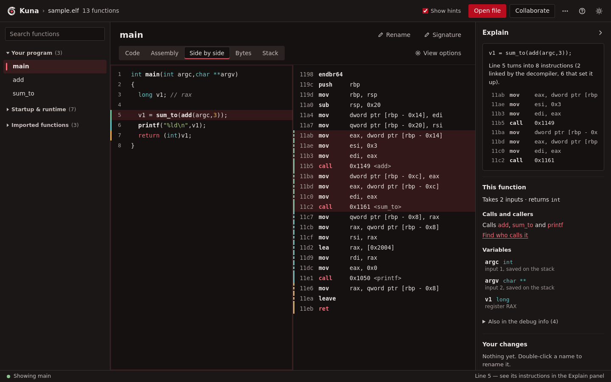

# Running kuna in the browser (WebAssembly)

How kuna decompiles **entirely client-side in a web browser** — the target choice, the
one seam that makes it work, the virtual-filesystem mapping, the build, and the tests.
Audience: kuna developers extending or maintaining the web front-end. The practical
"build and serve it" guide is `integrations/web/README.md`.

This is a genuine in-browser decompiler: the engine runs in a module Worker as
WebAssembly. Nothing is uploaded and no server participates in decompilation. A WASI
runtime implemented in JavaScript hosts the module; the browser is the whole stack. The
Worker keeps synchronous `wasi.start()` calls off the UI thread.

---

## 1. The decision: WASI, not a rewrite

The engine touches the outside world through an unusually thin surface:

- **no threads, no `rayon`** anywhere in the pipeline;
- the only subprocess calls are in the *CLI* layer (`kuna` spawning `decomp_dbg`) or are
  **test-only** (the hermetic `go build` in `kuna-analysis`'s no-return test) — none in
  the engine;
- engine wall-clock (`Instant::now()`) is reached only when a per-function
  watchdog is armed; fast whole-binary `decompile`/`project` commands arm the
  shared 10-second budget and the browser WASI clock supplies it;
- everything the decompiler loads — the target binary (via `LoadImage`) and the SLEIGH
  `.sla`/`.pspec`/`.cspec`/`.ldefs` (via `scan_language_database`) — arrives through plain
  `std::fs` **path reads**.

Those path reads are the key. **WASI** (`wasm32-wasip1`) gives a wasm module a POSIX-ish
filesystem backed by *preopened* directories, which a JS host can populate from memory.
So the engine's `std::fs::read(specfile)` / `std::fs::read(binary)` calls work **unchanged**
against a virtual filesystem the page assembles. The result: the full engine + analysis
stack (`kuna-base` · `kuna-num` · `kuna-sleigh` · `kuna-decomp` · `kuna-analysis` ·
`kuna-console`) and every dependency (`object`, `gimli`, `pdb`, the demanglers, `flate2`,
`smallvec`, `slotmap`) compiles to `wasm32-wasip1` with **zero source changes**.

The rejected alternative — `wasm32-unknown-unknown` + `wasm-bindgen` — gives a cleaner
JS-native API but has no filesystem, so it would require refactoring the engine's
spec-load and image-load reads to take byte buffers. That is real engine surgery for a
cosmetic API gain; WASI keeps the engine untouched, which is the whole point ("don't break
kuna"). A `wasm-bindgen` reactor front-end can be added *later* as an optimization (see §7)
without disturbing the WASI path.

## 2. Shape: a front-end crate + a browser harness

```
decompiler/crates/kuna-wasm/     the wasm (and native) binary: `kuna_wasm`
integrations/web/                the project site + browser harness (assembles a static dist/)
```

The deployed site has a **landing page** at `/`, a repository-derived **development
visualization** at `/dev-viz/`, and the **decompiler application** at `/decompile/` (§4.1).
Only the last one loads the wasm; everything below describes it.

`kuna-wasm` is a **purely additive leaf crate**. It depends only on existing engine crates
(`kuna-console`, `kuna-decomp`, `kuna-base`) and the already-present `object`; it adds no
new external dependency or wasm-only stage-model option. Like the native file
front-ends, it resolves the default `auto` mode from the input byte length and
uses the core `fast_funcdisc` option for rooted whole-image inventory recovery
with conservative pointer validation.
`make binaries` builds a
fixed crate list that does not include it, and
`check_spec.py` only scans `kuna-decomp`/`kuna-analysis`, so the only gate that touches it
is `make rust-test` (`cargo test --workspace`), which compiles it natively and
runs its frontend tests.

`kuna_wasm` runs `kuna decompile-all`'s core loop via the **shared decompile-project
core** — `kuna_console::project` (`decompile_targets` + the `.c`/`.h`/`.asm`/`README.md`
artifact builders, moved there from `kuna-cli` so wasm32-wasip1 can reach them without
`kuna-cli`'s subprocess/CLI machinery, which cannot compile for wasm). It reuses the
*exact* engine entry points:

```
metadata(binary).len() → auto_mode_for_size(...) // <500 KiB aggressive; <2 MiB reliable; else fast
  → bootstrap_from_object(binary, "", [spec_root])   // load image + resolve arch + build translator
  → apply concrete mode + command-scoped discovery policy + non-conflicting driver injections
  → commit_pending_analysis()                                   // the `read symbols` seam
  → kuna_console::project::decompile_targets(...)  // the same loop kuna decompile-all runs
```

Its `--json` is `kuna decompile-all --json`'s fields (`name`, `address`, `address_hex`,
`aliases`, `size`, `code`, `error`, `unstructured_gotos`,
`variables[{name,type,kind,arg_index,stack_offset,size}]`)
— including the one-record-per-entry contract and the `aliases` array documented in
`docs/cli.md`. Wasm `list` reports the full canonical callable-symbol inventory
under the selected mode. In `fast`, that inventory includes the bounded Listing's
direct-call closure and validated absolute pointer-table roots, not just loader
metadata.

**Every command shares one discovery policy — `list` included** (DIV-53). All three
commands apply the same `decompile-all` driver injections (`listing`, plus
`funcstart_patterns` and `aif` on a non-x86-64 target, each skipped when the selected mode
names that option), so the browser inventory is exactly the target set the `project`
export decompiles. This is where the wasm front-end deliberately diverges from `kuna
functions`, which keeps enumeration cheap: in the browser the sidebar is the *only* way to
reach a function, so an entry the inventory omits is a function the UI cannot open at all
— not a saved analysis. The window that matters is `reliable` (500 KiB–<2 MiB), the one
mode with no discovery overrides of its own; `aggressive` already turns all three on and
`fast` turns all three off, so those two were consistent before and after.

**Output language.** The **Language** control alongside **Mode** carries the same three
choices the CLI does: `auto` (the default), `C`, and `Rust`. `auto` follows the binary —
a Rust binary renders as Rust (DIV-80) — and, exactly like `auto` mode, it is resolved by
the ENGINE rather than by JavaScript: `kuna-web.js` passes the literal `auto` through as
`--language auto` and `kuna_wasm::resolve_language` decides. Nothing sniffs the binary in
the browser, so the browser and the CLI cannot drift apart on the policy. `project` is
excluded on both sides (its `.c`/`.h`/`.asm` export is C-shaped end to end), and the
syntax highlighter picks its dialect from the returned text, since the caller asked for
`auto` and only the engine knows what it resolved to.

That makes the mode a *product* decision in the browser, not just a speed dial, so the
page exposes it: a **Mode** control beside the file picker (`auto` — the default — plus
`fast` / `reliable` / `aggressive`), whose value is passed to `kuna.load` and carried by
the Worker session to `list`, `decompile` and `project` alike. Changing it re-indexes the
binary already loaded, because the mode changes the inventory itself and a sidebar that
disagrees with the bodies below it would be worse than either. Without the control a
binary at or above 2 MiB was pinned to `fast` with no way to ask for more: on a 3.4 MB
i386 PE the browser listed **3,495** functions where `reliable` finds **14,014** (IDA Pro
finds 14,576), and the page held the only copy of the uploaded bytes, so there was nowhere
else to go.

Unfiltered `decompile` and `project` use the shared CODE-backed target set, while
explicit address decompile suppresses that whole-image discovery pass and
reaches the requested entry directly. Name selection keeps discovery active so
a generated `sub_<addr>` name can resolve, then exports only the selected
function. This is the same selector/inventory split as the native front-end:
selecting one function does not silently export its discovered call closure.
The output adds one per-function field the native `decompile-all --json` does not
carry: `"kind"` —
`"func"` | `"plt"` | `"thunk"`
(`kuna-console/src/classify.rs`, shared with `kuna decompile-graph`: an `object`-crate
re-parse marks entries inside import-stub
sections — the `.plt` family, Mach-O symbol stubs — or named as imports as `"plt"`, and
lone-jump entries (`ConsoleProgram::lone_jump_target`, direct-to-another-function or
indirect) as `"thunk"`; the UI folds those below a divider). CLI:

```
kuna_wasm <binary> <spec-root> list [--mode MODE]
kuna_wasm <binary> <spec-root> decompile [name|0xADDR] [--mode MODE]
kuna_wasm <binary> <spec-root> project [<display-name>] [--mode MODE]
```

`project` is the `kuna decompile-project` flow with the folder write replaced by one JSON
document — `{binary, name, count, ok, failed, files:{"<name>.c", "<name>.h", "<name>.asm",
"README.md"}}` (artifacts named after `<display-name>`, default the binary's basename;
whole binary only). Omitted mode and explicit `--mode auto` use the shared
native/browser policy: `<500 KiB` selects `aggressive`, `500 KiB–<2 MiB`
selects `reliable`, and `>=2 MiB` selects `fast`. Because `project` is
whole-binary only, the fast selection runs `fast_funcdisc`: the downloaded C/H
inventory contains directly reached and validated indirect-only internal
functions while the exhaustive prologue and AIF scans remain off. The page's
**Download Binary Source** button runs it and zips the four artifacts inside the module
Worker (`integrations/web/zip.js`, a dependency-free STORE zip writer). Only the final ZIP
`ArrayBuffer` is transferred to the main thread. Two things differ from the CLI export.
The README's `Path` row shows the display name instead of a canonicalized host path
(there is none in the virtual FS). And the decompile order is address order: the
callee-first schedule a serial `kuna decompile-project` takes lives in the `kuna-cli`
driver (`--option protoorder`, `docs/cli.md`), while this command calls the shared eager
batch directly, so the browser's call-argument types and `struct_N` numbering are the
ones `--option protoorder off` produces.

**The study view's commands: `inspect`, `read`, `xrefs`, `strings`, and `--assert`.** Every command also
takes a repeatable `--assert <directive>` — the CLI's override plane, parsed by the same
grammar (`kuna_console::assertsyntax`, one directive per value; a value with a line break
is refused) and applied in the CLI's order (read-only propagation when a `readonly` range
implies it, `set_assertions` + the image-scoped directives before the analysis commit, the
program-scoped ones after it, the function- and symbol-scoped ones inside the decompile
loop). Four more commands serve the study view:

```
kuna_wasm <binary> <spec-root> inspect <name|0xADDR> [--mode M] [--language L] [--assert D]...
kuna_wasm <binary> <spec-root> read <0xADDR> <LEN> [--assert D]...
kuna_wasm <binary> <spec-root> xrefs <name|0xADDR> [--mode M] [--assert D]...
kuna_wasm <binary> <spec-root> strings [--mode M] [--assert D]...
```

Because every request is a fresh process, the page's edit session IS its directive list: it
resends the list on every call, and the same list replays natively as `kuna decompile
<bin> <fn> --assert @file`. What becomes of each directive is an `assertions` row —
`{directive, kind, phase, subphase, status, detail, fatal}`, the `decompile-all --json`
report — on every document (`list`, `decompile`, `inspect`, `read`, `project`). A directive
that binds to nothing is a `rejected` row and the command still exits 0 with its payload;
a directive that does not parse is the run's error (`error: --assert "<directive>": <why>`
on stderr, nonzero exit). What the page sends: for `inspect`, the program-wide directives
plus that function's own **unqualified** (`name v1 total`); qualify with the function's
*current* name (`name entry_main::v1 total`), never an address. A function rename is
`function 0xENTRY=<name>` — the inventory then lists `<name>` with the old names in
`aliases`, the new name selects it, and directives may be qualified with it. Parameters
retype and rename through `prototype 0xENTRY <C declaration>`; a global is `data 0xADDR
<type> <name>`; a byte patch is `bytes 0xADDR <hex>` (every later decode and `read` sees it).

`inspect` is one load and one function — the same batch `decompile <selector>` runs (with
its structure-naming convergence) with `structdefs on`, so its `code` is `decompile`'s byte
for byte below the definitions of the types the function names (the `kuna decompile
--option structdefs on` preamble, then a blank line; `types` lists the same set). Like
`decompile`, a name keeps the discovery walk on and an address skips `fast_funcdisc`.
`decompile` itself keeps the CLI's default and prints no preamble.
Compact JSON, every address a number plus an `_hex` twin:

```
{binary, language, target:{archid, processor, endian, bits},
 function:{name, address, address_hex, aliases, object_location, kind, size,
   code, error, proto, unstructured_gotos,
   line_mappings:[{line_number, addresses, addresses_hex}],
   variables:[{name, type, kind:"arg"|"stack", arg_index, stack_offset, size,
               line_numbers, addresses, addresses_hex}],
   types:[{name, definition, size}],
   globals:[{name, address, address_hex, declaration, size}],
   tokens:[{line, col, len, kind, color, text,
            address?, address_hex?, callee?, callee_hex?, var?, decl?, type?}],
   tokens_error: null | string,
   instructions:[{address, address_hex, offset, size, bytes, mnemonic, operands, text,
                  file_offset, lines}],
   instructions_truncated},
 assertions:[…]}
```

`tokens` is the token source map (`docs/spec/09-emission.md` §9.2): `line` is 1-based in
`code`, `col`/`len` are UTF-16 code units, and on each line the tokens' texts joined with
the gaps as spaces rebuild that line exactly (the engine verifies it before shipping; on
failure `tokens` is `[]` and `tokens_error` says why). `kind` is `syntax`, `variable`,
`value` (literals and case labels), `op`, `funcname`, `type`, `field`, `comment` or
`label`; `color` is the printer's highlight class (`keyword`, `comment`, `type`,
`funcname`, `var`, `const`, `param`, `global`, `none`, `error`, `special`). Optional
members appear only when known: `address` is the instruction the token stands for (a
comment's or label's own address in the code space), `callee` the entry a call's name
names, `var` an index into `variables` (register-only locals have no row), `decl` is
`local`, `param`, `return` or `function` inside a declaration, and `type` names the type
of a `type` token or the aggregate of a `field`. `instructions` is the `kuna disassemble
--follow` walk over the function's extent (`kuna_console::disasm`, the CLI's own walker:
branch targets start rows, literal pools fold to `.word`, undecodable bytes are `.byte`),
at most 4096 rows (`instructions_truncated`); `bytes` is lowercase hex and honours `bytes`
overlays, `offset` is `address − entry`, `file_offset` is where the instruction sits in the
input file (`null` outside file-backed sections), and `lines` (always present, `[]` when
none) are the `code` lines whose `line_mappings` name the instruction. `flow` says how the
instruction passes control on, read from its own p-code (`ConsoleProgram::insn_flow`):
`return`, `jumpind`, `jump`, `cjump`, `call` or `callind` (the strongest op it holds), or
`null` for straight-line code; `targets_hex` lists the code addresses its direct jumps
and calls name (`[]` when none). A branch within the instruction's own p-code is not flow. The line mappings
are sparse — a line maps to the instructions whose p-code its tokens were printed from, so
argument set-up that was folded away maps to nothing.

`read <0xADDR> <LEN>` returns `{binary, address, address_hex, size, bytes, file_offset,
assertions}`: up to 64 KiB, stopping where the mapped run holding the address ends (the
loader would zero-fill past it; an unmapped start is `size: 0`, not an error), overlays
applied, loaded with the discovery walk off. `xrefs <name|0xADDR>` answers from `kuna xrefs`' reference walk
(`kuna_analysis::listing::xrefs`, seeded with the inventory and focused on the function):
`{binary, function:{name, address, address_hex}, callers:[{name, address, address_hex,
from, from_hex, kind, instruction}], callees:[{name, address, address_hex, at, at_hex,
kind, instruction}], data_refs:[…as callees…], assertions}` — a caller's `address` is the
calling function's entry and `from` the calling instruction; callees are calls and jumps
that leave the function (`kind` `call`/`jump`), data refs are `data` (address taken),
`read` and `write`; all three lists are in instruction order. `strings` lists the rows
`kuna strings --encoding all` finds (minimum length 5, any ending) with who uses each:
`{binary, scanned, count, strings:[{address, address_hex, text, length, encoding,
section, in_code, uses:[{name, address, address_hex, at, at_hex, kind, instruction,
via}]}], assertions}`. A use is a `data`, `read` or `write` reference into the literal
from the same reference walk, built once for the whole image, `address` naming the
function that holds the instruction `at`. It also counts the uses of a pointer-aligned word in an
initialized data section that holds the address of a string outside code (`static const
char *secret = "flag{…}"` is read through `secret`, never by its own address); `via` is
then that word's `{name, address, address_hex}`, else null. These are code that happens to
read as text, so none of them is a use: a branch into a literal, a reference to a
function's entry or its Thumb address, a word pointing into code (a jump table, a function
pointer), and a load or store into a literal inside code (a literal pool; firmware keeps
its strings in code and uses them by address). `in_code` marks a row inside an executable
section. `list` adds `language`, `target`, `sections:[{name, address, address_hex, size,
file_offset, file_size, executable, writable}]` (allocated sections, in address order;
`file_size` is how many of the section's bytes the file holds from `file_offset`, which a
PE section's virtual size can exceed; `writable` follows the segment that maps the
section) and `known_types:[{name, size, kind}]` (the
factory's named non-core types: `struct`, `union`, `enum`, `typedef`, `scalar`), and
`decompile` adds the top-level `language` and the per-function `line_mappings`, `types`
and per-variable `line_numbers`/`addresses` of `kuna decompile-all --json`. The line
evidence costs a second render per function, so only a one-function `decompile` pays for
it; the whole-binary `decompile` carries the fields empty (`inspect` always has them).

## 3. The virtual filesystem (the whole trick)

`integrations/web/kuna-worker.js` calls `integrations/web/kuna-web.js`, which drives
[`@bjorn3/browser_wasi_shim`](https://github.com/bjorn3/browser_wasi_shim)
(vendored under `integrations/web/vendor/`, pinned in `VERSION`), a pure-JS WASI
**preview1** implementation. For each decompile it builds a fresh instance with two
preopened directories:

| Preopen | Guest path | Contents |
|---|---|---|
| specs | `/specs` | the SLEIGH tree — all the small runtime files preloaded, plus each `.sla` added as it's lazily fetched (`File` inodes reused across runs) |
| work | `/work` | `input.bin` — the user's uploaded bytes |

then runs `kuna_wasm /work/input.bin /specs decompile --mode auto` with `stdout` captured via
`ConsoleStdout.lineBuffered`. The captured stdout is the JSON the UI renders. This is the
same preopen model Node's `node:wasi` uses — the parity test (`test/parity.mjs`) drives
the identical wasm through `node:wasi`, and the glue test (`test/glue.mjs`) drives it
through the real browser shim; both must agree with native.

The page and Worker communicate through `kuna-worker-client.js`:

```
upload bytes → Worker `list` → address-only rows
open fn      → Worker `inspect 0xADDR --assert …` → code, tokens, rows
edit         → one more directive → Worker `inspect` again, old render kept up
download     → Worker `project` → Worker `makeZip` → transferred ArrayBuffer
cancel       → terminate Worker → create Worker → rehydrate binary on next request
```

Function bodies are cached by address in the page after the first click. Inventory,
one-function decompilation, and project export all retain `--mode auto`, so the Rust
front-end remains the source of truth for the 500 KiB and 2 MiB thresholds.

The Worker session carries the binary, the mode **and the output language** to every
request. `setBinary` once stored only the mode, so the first page's Language control
never reached the engine; `test/worker.mjs` loads with `rust` and asserts Rust comes back. Every Worker method (`list`, `decompile`,
`inspect`, `read`, `xrefs`, `strings`, `project`) also takes an `assertions` list, which
`wasmCommandArgs` appends as one `--assert <directive>` pair each, after the mode and
language; an empty list produces exactly the argv the flag's absence always did
(`test/auto-mode.mjs` pins both). A failed request keeps what the engine said: the error
reply carries `detail` (`exitCode`, `stderr`, and the stdout JSON when it parses), which
the client exposes as `error.detail`.

The study view holds a student's edits as that directive list (§2) and re-inspects the
open function after each edit (§4.2).

Termination is intentional. WASI execution is synchronous after `wasi.start()` enters
WebAssembly, so an ordinary cancel message cannot be handled until that call returns.
`Worker.terminate()` is the browser primitive that can stop it while leaving the UI
responsive. The client rejects every in-flight RPC with `KunaWorkerCancelledError`,
creates a clean Worker, and keeps the uploaded bytes on the page side solely to restore
the session for the next request.

If the Worker script is blocked before initialization (for example by a content-blocker
rule or a browser privacy setting), the client reports that startup failure separately
with the blocked path and instructions to allow the site and reload. The failed Worker is
terminated, and later RPCs reject with the same error instead of waiting forever on a
worker that cannot answer.

**Robust, format-agnostic specs (whatever the CLI supports).** The demo carries
**no per-format or per-arch logic** — the *engine* detects the format
(ELF/PE/Mach-O/COFF) and resolves the SLEIGH language for any binary, exactly as
`kuna decompile-all` does. Two facts make a lightweight lazy scheme possible:

- The decompiler reads only the **runtime** spec files — `.ldefs` + `.pspec` +
  `.cspec` + `.dwarf` (not the `.sinc`/`.slaspec` SLEIGH *source*). Those total
  just **~1.7 MB (~180 KB gzipped)** across the whole tree, so `build.sh` bundles
  them into `specs-small.json`, which `kuna-web.js` preloads once. With them
  present, `scan_language_database` can resolve **any** binary.
- The one heavy per-language file — the **`.sla`** (~475 KB) — is the only thing
  fetched per binary. When it's absent the engine fails with
  `Could not find .sla file for <language-id>`; `kuna-web.js` maps that id → its
  `.sla` (via the `slafile=` in the ldefs it already holds), fetches it from the
  server, and retries. Fetched `.sla` are cached across decompiles.

So the browser downloads the ~180 KB bundle once, then ~475 KB per distinct
language — and supports every format/architecture kuna has a `.sla` for, with the
engine as the single source of truth (no `e_machine` parsing, no arch manifest).
Verified end to end here: ELF (x86-64, AArch64) and Mach-O `native == wasm ==
browser`, and a real PE executable (152 functions) through the browser lazy path.

## 4. Build & payload

`integrations/web/build.sh` builds `kuna_wasm.wasm` for `wasm32-wasip1`, applies
`wasm-opt -Oz` if available, and assembles a self-contained `integrations/web/dist/`:
the site + glue + vendored shim + wasm, the **full runtime SLEIGH tree** under `specs/`
(every `.ldefs`/`.pspec`/`.cspec`/`.dwarf`/`.sla` — ~15 MB static, lazily fetched), and
the `specs-small.json` preload bundle. Serve `dist/` with any static file server.

### 4.1 The site layout

```
/                     index.html          landing page: hero, compare, goals
/dev-viz/             dev-viz/index.html development record: cadence, phases, provenance, evidence
/decompile/           decompile/           the decompiler: linked code, assembly, bytes and stack, edits,
                                           live sessions (loads the wasm; §4.2)
/assets/              css/site.css · fonts/ · img/ · js/highlight-c.js · js/fnfilter.js
/compare-samples.js   the compare section's data (samples + rival outputs)
/CNAME                kuna.noelo.org — the custom domain, copied into the bundle
/kuna-web.js /kuna-worker.js /kuna-worker-client.js /zip.js
/kuna_wasm.wasm /specs/ /specs-small.json /vendor/
```

The engine-facing files stay at the **root** — `/decompile/` reaches them with `../`, so
the Worker is a sibling of `kuna-web.js`/`zip.js`, the existing tests can import the glue
directly, and a project subpath still works. The RPC client resolves the wasm/spec URLs
against the document before sending them to the Worker; resolving those `../` paths in
the root-level Worker would otherwise escape a GitHub Pages project subpath.

**The function search.** A whole-binary inventory is thousands of rows (the 1.1 MiB PE in
DIV-53 indexes 3,158), and the function list is the only way to reach a function, so it is
searchable: `/` from anywhere focuses the box, typing narrows the list live, `Enter` opens
the first match, `Escape` clears, and `↓` moves to the first visible row. A query is
either whitespace-separated terms — ALL of which must appear in a row's name, one of its
aliases, or its address, case-insensitively, so `sub_4e6` and `4e68` and `_dws` all work on
a stripped binary — or a `/regex/flags` literal (case-insensitive unless it names flags; an
unparseable one flags the box and reports the error instead of silently emptying the list).
The matcher is `assets/js/fnfilter.js`, kept DOM-free so `test/fnfilter.mjs` can pin it
under Node (§5); the page owns row visibility, focus and the group counts (§4.2).
Filtering is a single pass over precomputed per-row haystacks, and the inventory is built
into one `DocumentFragment` so a multi-thousand-row list reflows the sidebar once, not per
row.

The landing page and `/dev-viz/` share the Noelo Lab site's palette and typefaces
(`noelo.org`, BSD-2-Clause; provenance note at the top of `assets/css/site.css`) but not
its layout: they are tool pages — one display line, then monospace throughout, small
red-ticked section labels instead of a lab-page rail. `/decompile/` has its own stylesheet
on the same palette, dark by default (§4.2); `assets/js/highlight-c.js` is the single C
highlighter shared by the compare panes and the decompiler. The landing
page is otherwise inert — no wasm, no network — and `compare-samples.js` is pure data, so
adding a comparison is a data edit (its header documents the schema; every pane must be
verbatim tool output).

The samples are **mined, not chosen by hand**: `python3 -m scripts.decbench.showcase` reads
the DecBench results tree for optimized, medium-sized functions where kuna out-scores IDA
and no rival out-scores kuna, dumps all five panes plus the original source per candidate,
and re-decompiles each one with the current build (`--verify`) so a shipped pane is still
byte-for-byte what kuna prints today. Every sample carries the measured GED for the pair on
screen (`ged:` in the sample, rendered under the dropdowns). A mined candidate is never
shipped unread — the selection procedure, including what disqualifies a sample, is
`docs/decbench-loop.md` → *Finding good kuna examples*.

The section shows **provenance and the measured score, and nothing else** — no captions,
and a neutral dropdown label (`fn() — project binary, arch`); the reader draws their own
conclusion from the two panes. The right pane defaults to IDA. The one display-only
normalization is in `index.html`'s `tightenHeader`: kuna and Ghidra both print a blank line
between a function's signature and its opening brace, and it is collapsed so the panes
start level. It is whitespace, and only before a column-0 `{` — the committed data stays
byte-verbatim, which is what `--verify` checks against.

**Hosting on GitHub Pages.** `.github/workflows/pages.yml` runs this same build in CI
(stable Rust + `wasm32-wasip1`, `binaryen` for `wasm-opt`, `make specs` to compile the
whole `.sla` tree) and deploys `dist/` via `actions/deploy-pages`. All asset references are
relative, so it serves correctly either from the custom domain or from a project subpath
(`https://<owner>.github.io/<repo>/`); no COOP/COEP headers are needed (no threads /
SharedArrayBuffer). Enable once under *Settings → Pages → Source = GitHub Actions*.

The site is **`kuna.noelo.org`**: `integrations/web/CNAME` is copied into the bundle by
`build.sh`, and DNS points that name at GitHub Pages. With the Actions deploy flow the
repo's *Settings → Pages → Custom domain* field is the authoritative half — set it there
too, or the CNAME file alone may not claim the name.

Payload: **~1.7 MB** wasm (gzipped, shared) + a **~180 KB** gzipped spec bundle once, then
**~475 KB** per distinct language (`.sla`, fetched on demand and cached). The ~15 MB of
`.sla` sit on the server; only what a binary actually resolves to transfers. Cold decompile
of a small binary is sub-second (≈0.45 s measured in Node `node:wasi` and in headless
Chrome on the committed fixtures).

### 4.2 The decompiler (`/decompile/`)

The site's decompiler page: one function as **its code, assembly, bytes and stack frame,
linked**, with renames, retypes, prototypes, comments and byte patches that the engine
applies, and live sessions with other people. It began as a second page for students at
`/decompile2/` and replaced the first `/decompile/` page; the old address is gone. The
`kuna.d2.*` storage keys and the BroadcastChannel names are unchanged, so saved sessions
carry over. The landing page and `/dev-viz/` link to it from their nav;
it asks search engines not to index it (`<meta name="robots" content="noindex">`).

It is written for someone who has never used a decompiler, so it is laid out like an
app: full screen, with its own stylesheet (`decompile/decompile.css`). The colours are
the Noelo palette of the rest of the site, dark by default — Noelo's dark footer (warm
near-black ink, warm greys, the mark's red for the accent and the primary button, flat
1px rules, near-square corners) stretched to a whole app — and the toggle switches to
Noelo's light paper, where the primary button is ink. The type is the app's own: a
system UI font, monospace only for code, no uppercase labels. Every text colour passes
WCAG AA 4.5:1 on each background it sits on. Labels are plain sentence-case words
("Code", "Side by side", "Explain", "Your changes"), and whatever a beginner does not
need at first sight is off by default or one click away.

```
| Kuna › sample.elf  13 functions  ☐ Show hints  [Open file] [Collaborate]  ⋯  ?  ☾    |
|--------------------|-----------------------------------------------|------------------|
| Search functions   | main                        Rename  Signature | Explain       ›  |
| ▾ Your program (3) |                                               | This function    |
|    main            | [Code|Assembly|Side by side|Bytes|Stack]      | Takes 2 inputs   |
|    add             |  5 ▌ total = sum_to(add(argc,5));             | Calls and        |
|    sum_to          |  6 ▌ printf("%ld\n",total);   ┌ Line 5 → 2 ┐  | callers          |
| ▸ Startup &        |                               │ 11b5 call  │  | Variables        |
|   runtime (7)      |                               └ +6 set-up ─┘  | Your changes (2) |
| ▸ Imported (3)     |                                               | Undo  Redo  ⋯    |
|--------------------|-----------------------------------------------|------------------|
| ● Showing main                      total — press N to rename, Y to change type       |
```



**Layout.** A top bar, the body and a status bar. The top bar holds the file name and its
function count, the *Show hints* checkbox, *Open file*, *Collaborate* (the live-session
dialog, below; its tooltip and accessible description say what it is, and before a
program is open it is off, saying "Open a program first"), a ⋯ menu (*Download C code (.zip)*,
*Download patched program*, *Decompiler effort* — Automatic, Fast, Reliable, Thorough for
`--mode` auto/fast/reliable/aggressive —, *Show code as* — Automatic, C, Rust —,
*Keyboard shortcuts*, a link home), help, and the light/dark toggle (dark until it is
pressed; the choice is kept, and a stored "system" from an earlier build reads as
dark). Before a file is open the body is a welcome screen: **Decompile a binary program**,
"Open a program to generate source-like code for it running 100% in the web browser
using WASM", and a drop zone with *Open file* and *Paste base64*. A
file dropped anywhere on the page opens too; the page reads the bytes before it clears
the input, so picking the same file again works. A program can also arrive as base64
text: *Paste base64* (or *Open base64 text* in the ⋯ menu) asks for it, and Ctrl+V
outside a text field opens a pasted file or base64 text directly. `decompile/base64.js`
accepts `base64` output with its line breaks, a `data:…;base64,` URL and the URL-safe
alphabet, and names the program `pasted.elf`/`.exe`/`.macho`/`.bin` by its magic; a
Ctrl+V paste under 16 bytes (a stray word such as `main` is valid base64) only warns. With a file open the body is three
columns: the function list, the function (its name alone, with its address as the
tooltip; *Rename* and *Signature*, the view switch, *View options*), and the Explain
panel, which can be
closed. Below 1280 px the Explain panel is a drawer; below 900 px the function list is a
drawer too, and *Side by side* shows one view with a note saying it needs a wider window.
The status bar says what the page is doing in a sentence ("Decompiling main…", "Showing
main", "Updated the code"; timings in its tooltip) and, on the right, what the current
selection lets you do.

**The function list.** `groups.js` sorts the inventory into *Your program* (open; `main`
first, then by address), *Startup & runtime* (`_start`, `frame_dummy`,
`__libc_csu_init`, MSVC's `mainCRTStartup` family, x86 PC thunks …) and *Imported
functions* (PLT and import thunks), the last two closed. A name the lists do not know
stays in *Your program*: hiding real code is worse than showing one helper too many.
Loading a binary opens `main` (else the program's first function) without a click. The
search box is the §4.1 matcher; while it holds text, a group with matches opens and
counts `shown of total`, and clearing it puts the groups back the way they were.

**Views and defaults.** *Code* (C, or Rust under ⋯ → *Show code as*), *Assembly*, *Side
by side* (the code next to its assembly), *Bytes*, *Stack*; keys `1` `2` `3` `4` for
Code, Assembly, Bytes, Stack and `s` for side by side. Every default is chosen for a
first look, and every
one is a control under *View options*: instruction bytes hidden (the single view and
side by side keep separate settings), the C shown as a heading above its assembly
("Function setup" and "Function cleanup" head the prologue and epilogue; *As comments*
and *Off* are the alternatives), no addresses beside C lines, full addresses, jump
arrows, set-up instructions grouped with their line, a 450 ms hover delay, and the easy
spelling of assembly. The easy spelling (`asm-view.js` `spellInsn`) is display only —
lowercase mnemonics and registers, a space after each comma, and `[rbp - 0x14]` rather
than `[RBP + -0x14]`, for x86, AArch64 and A32; `<symbol>` targets, strings and
`.byte`/`.word` data are left as they are. Each row's tooltip is the engine's text,
and every lookup (notes, idioms, stack operands, links) reads the engine's text, so
*Exactly as decoded* changes the letters and nothing else. The first function shows a
one-time tip (*Got it*). Settings are `kuna.d2.prefs` version 3; a version-1 record keeps
its view and its choices and takes the new defaults for the settings whose default
changed, and a version-2 record keeps everything but its `hints` (see below).

**Show hints.** Off by default; **`?student=true`** in the address turns them on for that
load (a class can hand out `/decompile/?student=true`), and `?student=false` turns them
off. Otherwise the checkbox decides, and ticking or unticking it is remembered as the
student's own choice (`hints` with `hintsSet`), which then wins over the address for the
rest of that load. Versions 1 and 2 of the settings stored `hints: true` as a default,
not a choice, so version 3 does not carry it over. Hints are what is there to teach
rather than to inform: the one-time tip, the key hints in the status bar, **the hover
cards** on the code and on the assembly rows (their content explains), what a mnemonic
does and the idiom notes (in the Explain panel and the assembly rows), "v1 is a name the
decompiler made up", the Bytes view's how-to line, the Stack view's explanation, its
notes on the return address and saved registers and its overflow/red-zone callouts.
Hovering still marks a line and its instructions in every pane (that is linking, not a
card). Facts stay: sizes, offsets, types, where a variable lives, which line an
instruction came from. Each teaching element carries `d2-teach` (or is one of a few
named elements), and one CSS rule under `:root[data-hints=off]` hides them all, so
nothing re-renders; a script in the page's head sets that attribute before the page
draws, so nothing flashes.

**The Explain panel.** Three parts. *What is selected*: a variable (its kind, type,
which input it is, where it lives in words — "the stack, 28 bytes below the return
address" —, the lines that use it, *Rename* and *Change type*), an instruction ("5 bytes
at 11b5, 29 bytes into main", what the mnemonic does, its C line, *Replace with NOP*,
*Edit bytes*, *Add a note*), a C line (its instructions, and each note kuna left at its
end — `// branch-flip`, `// no-return`, `// early-return x10` — in words, which the hover
card shows too) or a stack slot. `e` opens and closes the panel. *This function*: its inputs and
return type in words, *Calls and callers*, *Variables*, and behind disclosures the
variables only the debug info has and the types. *Your changes*: one plain line per edit
("Renamed v1 → total", "Patched 1 byte at 11af"; the directive is its tooltip) with a
✓/✗/• mark, edit and remove, *Undo* and *Redo*, and a ⋯ menu to export, import, copy the
command line, or clear.

**Modules** (`integrations/web/decompile/`; all but `app.js`, `hover.js`'s controller,
`sync.js`, `dialogs.js` and `rail.js` are DOM-free, so Node tests import them from the
source tree):

| Module | Role |
|---|---|
| `app.js` | operation model (one engine request at a time; callers load only when idle), the grouped function list, `openFunction` with an LRU(32) cache, views/side by side/history (`#0x…`), View options, the Explain panel's cards, applyEdit, keyboard |
| `render-c.js` | `normalizeInspect` (an `inspect` or a plain `decompile` document), the C pane from the token stream with a per-line regex fallback, the shared index, `changedLines` |
| `asm-view.js` | instruction rows: addresses abs/rel/both, bytes, the C line per run (heading or comment), the easy spelling, bands, linked targets, stack operands, branch arrows |
| `hover.js` / `sync.js` | the hover card; one selection/hover model across panes |
| `session.js` / `ctype.js` / `persist.js` | edits as directives; C declarators and signatures; per-binary storage |
| `dialogs.js` / `rail.js` | popovers and toasts; the Explain panel |
| `groups.js` | the function list's three groups and the function to open first |
| `bytes-view.js` / `arch.js` | the hex dump and the patched file; no-op fills |
| `mnemonics.js` / `stack-frame.js` / `xrefs-view.js` / `help.js` | instruction notes and idioms; the frame diagram; calls and callers in words and the `x` cross-references dialog; the help dialog |
| `wrap-c.js` / `tags.js` | where a long C line breaks; kuna's end-of-line notes (`// branch-flip`, `// early-return x10`) in words for the Explain panel and the hover card |
| `strings-view.js` | the sidebar's Strings list: its three groups, the users of each string, the search and the row cap |
| `prefs.js` / `addr.js` | view settings (`kuna.d2.prefs`, v3 with the v1 and v2 migrations) and `hintsOn`; addresses as hex strings and BigInt |
| `collab/` | *Working together* (below), loaded with a dynamic `import()` only when a session starts or an invite or reply link is opened: `collab.js` (dialogs, the roster, following), `sync.js` (the page's side: the Session ⇄ register sync, joining and leaving, where a session is stored), `group.js` (the protocol: hello, snapshots, relayed introductions, file transfer, digests, limits), `link.js` (WebRTC and BroadcastChannel links), `replica.js` (registers, `validOp`, digests, the register-based undo), `wire.js` (messages and their checks, invite and reply codes), `sdp.js`, `presence.js` (pointers and pings), `collab.css`; all but `collab.js`, `link.js` and `presence.js` are DOM-free (SHA-256 is `../sha256.js`, shared with the page) |

**Linking.** Every pane shares one index: a C line's instructions are the union of the
engine's `instructions[].lines`, `line_mappings` and the addresses on that line's tokens
(each alone can be sparse — the provenance maps calls and returns, not every move). A
line and its instructions share a colour band. Hovering marks the other panes without
scrolling them; selecting (a line, an instruction, a variable, a stack slot) marks every
pane, scrolls the others to it and fills the Explain panel's card. The hover card waits
450 ms by default (View options → Hover delay: Instant, Short 250, Normal, Slow 800,
Off; with *Show hints* off there is no card at all), switches instantly while open, and hides on pointer-out (120 ms grace), scroll,
wheel, blur, mousedown and `Escape`; a touch long-press (500 ms) and arrow-key
navigation show it too. It shows a C line's instructions ("Line 5 → 2 instructions", up
to 10), a call's callee and signature, an instruction's size and place in words with its
C line and a note on its mnemonic and any idiom, a stack operand's slot.

**Inferred attribution.** The engine maps a line only to the instructions whose p-code
reached the printed statement, so `v1 = sum_to(add(argc,3));` maps to its two CALLs and
the MOVs that set up their arguments to nothing, and a jump, a shared epilogue or a
`mov eax,1` folded into `return 1;` to nothing either. `asm-view.js` `inferLines` gives
every one of them a line, basic block by basic block (the blocks come from each row's
`flow` and `targets_hex`; an engine that sends neither falls back to reading jumps from
the mnemonic). Inside a block an unmapped instruction between a mapped one on line a and
the next on line b belongs to b when b ≥ a (it sets b up), else to a (it finishes a).
What trails a block's last mapped instruction finishes its line, except where the block
leads into a shared tail — one epilogue and `ret` serving several `return` lines — where
it takes the first of that tail's lines at or after its own (`mov eax,1; jmp epilogue`
after line 51's call is line 52's `return 1;`). A block with no mapped instruction takes
its line the same way from the block that reaches it. The frame set-up at the entry
(x86/AArch64: `endbr64`, pushes, `mov rbp,rsp`, `sub rsp`, argument-register spills and
copies into callee-saved registers, the canary load) is the prologue, on the signature
line; the cleanup in front of a `return` is the epilogue, on the lines of that return, or
on the closing `}` when the engine mapped the return to nothing. Anything still left
takes the line before it, so no instruction is unmapped. Inferred rows are marked, not
passed off as the engine's: a dashed band, `data-inferred="1"`, and the card reads
`Line 5 → 2 instructions` then `+6 that set it up` with those rows dimmed. View options'
"Group setup instructions with their line" (pref `asmInfer`, default on) turns it off.
The heading mode draws the same runs as blocks: one heading per C line, and "Function
setup" over the frame set-up.

**Long lines.** The C pane wraps a line wider than the pane (`wrap-c.js`, pref `cWrap`,
View options' "Wrap long lines to fit", default on). The line is read as nested bracket
groups; a group that does not fit breaks at its loosest operators first (`;`, then `,`,
`?:`, `||`, `&&`, `|` … `*`), all of that kind at once, and its continuation rows line up
after its opening bracket; only then are the pieces and the groups inside them broken,
a piece's own continuation four columns in from it. An assignment's `=` breaks only when
breaking inside its right-hand side cannot make the line fit; strings and comments never
break. The breaks are a newline and spaces inside the row's `.ct`, so a wrapped line is
still one `.d2-cl` row with one line number, and selection, hover and the line index are
unchanged. The width is measured from the pane, and a `ResizeObserver` re-wraps only the
rows that change when the pane is resized.

In side by side every operand cell carries its full text as a `title`, and `b` toggles
the bytes column for the current layout (each layout keeps its own setting).

**Keys** (none fire while typing in a field): `/` search · `Space` C ⇄ assembly · `1-4`
C code, Assembly, Bytes, Stack · `s` side by side · `o` address format · `b` bytes column
· `↑↓` lines/rows · `←→` names on a line · `Enter` open the callee · `n` rename · `y`
retype (on a function name: signature) · `;` note · `g` go to · `x` cross-references ·
`e` the Explain panel ·
`u`/Ctrl+Z undo · Ctrl+Shift+Z redo · Alt+←/→ history · `?` help · `Esc` closes the
card, then a dialog, then the selection · in a live session, `p` (or Alt+click) points the
others to what is under the mouse. `x` opens a list to jump from: on a
function name (or with nothing selected, the open function) who calls it and what it
calls, from the engine's `xrefs`; on a variable the lines of this function that use it,
each marked declared, set, read or input, and for a global also the functions that refer
to it; on an instruction that names an address, the references to that address. `↑↓`
move through it, `Enter` or a click jumps there. The help dialog lists the ten worth knowing
first and the rest under *All shortcuts*, then a glossary of the names a decompiler
invents and what the colours mean.

**Edits are directives.** Each edit is one record in `session.js`, keyed by what it
describes:

| Edit | Directive |
|---|---|
| rename a local | `name v1 total` |
| retype a local (and/or rename it) | `type v1 unsigned long total` — one directive, the name pinned so a retype cannot renumber `vN` |
| rename/retype a parameter | `prototype 0x1161 long sum_to(int count)` — `name`/`type` on a parameter hits `More than one symbol named` on a DWARF binary |
| rename a function | `function 0x1161=summation` |
| name/type a global | `data 0x4010 int counter` |
| comment an instruction | `comment 0x11b5 calls add first` |
| patch bytes | `bytes 0x11e1 9090909090` (contiguous bytes form one run; writing the original byte back removes it) |

`inspect` gets the global directives plus the open function's, **unqualified** (the engine
rejects an address qualifier, and a name qualifier must be the function's current name).
`project` and the exported file qualify every function-scoped directive with the
function's **current** name (`name summation::v1 i` after `function 0x1161=summation`).
`list` gets the global directives minus function renames; the sidebar overlays the
session's names itself. Each edit snapshots the session, re-inspects with the previous
render still up (a thin progress bar; scroll and selection kept), flashes the lines that
changed, and records every `assertions[]` row against the record that produced it:
*Your changes* marks it applied (✓) or rejected (✗, with the engine's reason, also
toasted). A
rejected directive stays in the session; a request that fails or is cancelled restores
the snapshot (working alone; in a live session the change stays, see *Working
together*). The engine refuses a retype that changes a local's storage size (`Storage
is 8 bytes, the stated type is 4`), so the retype dialog warns before sending one, sizing
`long` by the target's data model (4 bytes on Windows). A directive the engine cannot
parse fails the whole request (`error: --assert "<directive>": …`, exit 1): the page
matches that against the directives it sent, marks the record refused (✗ with the
reason; it is no longer sent, and exported only as a comment; every record that gives
the same text is marked, since the retry leaves out all of them), and retries without it,
so a bad stored or imported directive never locks a binary out. A failed `list` with no
directive to blame retries with none and says which were dropped. Editing any record
clears its old outcome until the engine answers again (another person's changes, applied
in a session, clear only the outcomes of the records they change), and a rail edit changes the
record in place (a comment stays a comment of its function). Each line in *Your
changes* is a sentence ("Renamed v1 → total", "Note at 11e1: …") and its directive is the
tooltip. The inspect cache is keyed
by the function's address and the directives it was inspected with, so an edit
re-decompiles only what it affects.

**The Rust view.** With *Show code as* = Rust the engine prints Rust, but directives
are C: local renames, function renames, comments and patches work as in C; retypes,
prototypes, parameter renames and globals need a C declaration the Rust view does not
show, so they say they need the C view (⋯ → *Show code as* → C) instead of opening a
dialog. The Explain panel reads the parameters from the Rust signature.

**Export and persistence.** *Export changes* (the ⋯ under *Your changes*) downloads
`<binary>.kuna`: a `#` header (binary,
hash, time, and the replay command `kuna decompile <binary> <function> --assert
@<binary>.kuna`) then one directive per line, which the native CLI replays verbatim.
Import reads the same format; an unqualified function-scoped line binds to the open
function, and a directive the page does not model is kept verbatim. The session is also
saved in `localStorage` per binary — `kuna.d2.session.<hash>`, the SHA-256 of the bytes
(computed in JS outside a secure context, where WebCrypto is missing; what an earlier
version stored there under its FNV-1a key is found and moved to the SHA-256 key, and that
key, two passes over the whole program, is worked out only when such an entry exists), at
most 20 binaries (`kuna.d2.index`, least recently used evicted; a full or throwing store
never breaks the page; when storage is full, copies of live sessions kept apart are
evicted before any of the student's own) — and loading the same file again restores it: a
toast, and a "Restored N changes from last time. Discard them" banner in *Your changes*.

**Patching.** The Bytes view is the function's bytes: instruction bytes from the engine,
the gaps from the page's own copy of the file through `sections[].file_offset`, patched
bytes marked (hover shows the original). Click a byte and type hex; a burst of typing is
one edit, sent 700 ms after the last key. A selected instruction offers *Edit bytes*
(warns when the new bytes are shorter than the instruction — the CPU decodes the rest as
something else — or longer), *Replace with NOP* and *Undo patch*. NOP fills are exact or absent: x86 `90`, AArch64
`1f2003d5`, A32 `0000a0e1`, Thumb `00bf`, MIPS `00000000`, PowerPC `60000000` (big-endian) /
`00000060`, RISC-V `13000000` or `0100`. ⋯ → *Download patched program* (disabled,
with the reason under it, until a byte is patched) writes each run at its file offset
into a copy of the file and downloads `<name>.patched.<ext>`; bytes no file byte
backs (`.bss`, an image without a section table) are reported and nothing is downloaded.
A Mach-O needs re-signing (`codesign -f -s -`); a PE's checksum no longer matches. `g` to
an address outside every function shows the bytes there (from the file, else a `read`
without directives, so a byte's original is the file's even when it is patched). A
section whose file data is shorter than its size (`file_size`, a PE section's
zero-filled tail) has no file offset past it.

**Learning aids.** The Stack view draws the frame from the prologue and the engine's
variables with offsets from the stack pointer at entry (`[RBP - 0xc]` is entry − 0x14
after `PUSH RBP; MOV RBP,RSP`), one box per row — how many bytes below the return
address on the left, then the name and type, a short description (the full text in its
tooltip) and the size: return address, saved registers, locals, unused space,
debug-info-only variables dashed; a stack array gets a callout naming what an overflow
reaches, a leaf without `SUB RSP` the red-zone note (x86 only). Instruction hints label
prologues, epilogues, canary loads and checks, `xor r,r`, `test r,r`, `cdqe`, `endbr64`
and the variadic `mov eax,0`. *Calls and callers* reads as sentences. The callees come
from the function's own CALL rows at once ("Calls add, sum_to and printf"); who calls it
comes from the engine's `xrefs` on request (*Find who calls it*), each caller
linked to the calling instruction and saying how it refers ("Called by _start (uses its
address)"), plus "Uses data at …". If the request fails, the panel keeps the callees and
says why.

**Type definitions.** When a function names a struct, union, enum or typedef (a
`struct_0` the decompiler worked out, a DWARF struct, a library type such as `FILE`), the
Code view opens with their definitions under the heading *Types this function uses*, on a
shaded block, and the function starts below them. The heading folds the block; a block of
more than 30 lines (a debug-info or C++ program can name dozens of types) starts folded,
and a student's own choice holds for the rest of the visit. Folded, the keyboard starts at
the signature; the Stack view's "only in the debug info" test ignores the block. It is the engine's own text, so
line numbers match `kuna decompile --option structdefs on`; it is highlighted but not
clickable (a field name is not a variable to rename), and selecting one of its lines says
which type it defines, that a `/* opaque */` one is a library type whose fields are not
known, and for a `struct_N` what `field_0x8` means (`render-c.js` `preambleLength`, the
lines before the signature).

**Strings.** The sidebar switches between *Functions* and *Strings*. The first time the
Strings list is shown the page asks the engine for `strings` (once per program and mode,
when nothing else is running) and lists the text in three groups: *Used by the code*
(open), *Not used directly* and *Inside machine code*. Each used string says which
functions use it ("Used in check ×2 through the pointer secret"). A function's name opens
it with the using instruction selected, so the line of code holding the string is
highlighted, and clicking it again steps to its next use there; clicking the string goes
to its first use, or for an unused one shows its bytes. The search works as the function
search does (terms or `/regex/`, `/` to focus it) and opens the groups it matches in. At
most 300 rows of a group are drawn; the search reaches the rest.

**Working together.** Several people can work on one program at once, with no server:
each person's page renames, retypes, notes and patches, and everyone sees the others'
changes, where they are, and their pointers. *Collaborate* in the top bar asks for a
name and makes an **invite link**, `/decompile/#join=<code>`; the
dialog says plainly that whoever opens it receives a copy of the program. The code lives
in the fragment, which browsers never send to a server, and holds only what the other
page needs to connect: the inviter's name, the program's name and size, and a compact
WebRTC offer (the ICE username and password, the DTLS fingerprint and the candidate
addresses, about 300 characters in all, rebuilt into SDP on the other side from
validated fields only; `sdp.js`). One link lets one person in.

The guest opens the link and presses *Join*. If a tab of the same browser made the
invite, the two pages find each other over `BroadcastChannel` and are connected at once
(the zero-setup demo: two tabs). Otherwise the guest's page shows a **reply link**
(`#reply=<code>`) to send back. The inviter clicks it: it opens a tab of the same page in
their own browser, which hands the reply to the waiting tab over `BroadcastChannel` and
says "Connected — you can close this tab"; a paste box in the invite dialog is the
fallback. A one-step join is not possible without a server: something has to carry the
guest's reply back to the inviter, and with no relay the people do. The guest's answer is
passive (`a=setup:passive`, the inviter starts the DTLS handshake), so a reply opened
minutes later still connects (measured to 30 minutes; the analysis is in
`docs/features/decompile-collab/analysis.md`). A pair that cannot connect directly is
told "Could not connect directly." with what to try: on a session within one network, a
new link with *Connect across the internet* ticked; on one across the internet, another
network (some campus and office Wi-Fi block direct connections).

*Connect across the internet.* The invite dialog has a box, **Connect across the
internet**, unticked by default; its **?** explains it on hover or focus. Unticked, the
pages use no ICE servers, so sessions work between tabs of one browser and between
computers on one network. Ticked, the page asks Cloudflare's public STUN server
(`stun.cloudflare.com:3478`: free, no account) for its internet address, which then goes
in the invite link beside the others. The STUN server learns only that address; none of
the program or the changes passes through it. The choice is the session's: the page that
starts the session decides it for all its links, and a guest's page answers an invite
that carries an internet address (`crossesNetworks` in `sdp.js`) with STUN too, so the
guest has no box and the join dialog says that joining shares their address. Introductions
inside the session follow the same choice. The box is remembered in the `localStorage` key
`kuna.d2.collab` (`"stun": true`, or a `"stun:host:port"` URL for another server), which
also keeps the name last used. If STUN finds no internet address, the invite says the link
may work only on that network. Pairs that STUN cannot connect (symmetric NATs, networks
that block UDP) need a TURN relay, a server that carries the encrypted traffic and the
part that costs money. There is no switch for it in the page: `{"turn": {"urls":
"turn:host:3478", "username": "…", "credential": "…"}}` in the same key, set in the
browser's console, adds one to every link.

*What travels.* Only the edits, never the C: every page runs its own engine on the same
bytes, so the same directives give the same code. The session is held as
last-writer-wins registers, one per field a student can change (a local's name and its
type, a function's name, a signature, a global's name and type, a type definition, a
note, each patched byte, each directive the page does not model) plus the **decompiler
effort**, which is shared because the engine's symbols depend on it (the same `v20` is a
different variable in Fast); *Show code as* stays each person's own, and the ⋯ menu says
"changes it for everyone" next to the effort. Each write carries a Lamport clock
`[counter, page]` and the larger wins everywhere, so a rename and a retype of one local
made at the same moment both survive, and pages that have seen the same writes hold the
same session in whatever order the writes arrived.

*Order.* Order matters to the engine: a type must come before the types that use it, and
of two rename steps (`v1` → `i`, then `acc` → `v1`) the first must replay first. Working
alone, the directives keep the order they were made in, grouped by kind (a changed
record keeps its place), and the exported file replays in that order. In a session,
each kind is ordered by each register's **birth clock**, the smallest clock any page has
written it with. It is merged as a grow-only minimum and sent with every op, so every
page sends the engine the same list, and a later edit of a type does not move it
behind the types that use it. Leaving a session keeps the order the session had.

*Edits.* A page sends only what its student changed. After each change the page compares
its Session's registers with a **base**, the registers the Session held when it last
matched the replica, not with the replica itself. The replica runs ahead of the Session
while the others' changes wait to be applied, and comparing against it would send their
changes back as this page's deletions. The others' changes are applied together, once per
frame (16 ms), through the page's remote path, and the base moves with them. Bytes being
typed are the exception: a burst goes out as one change (one Undo step) when it ends,
700 ms after the last key, and until then the others' changes to those bytes do not
replace what the student typed (the burst, being newer, then wins everywhere). That path
re-decompiles the open function only when they touch it (once per burst, 300 ms after
the last, when no request is running) and adds no undo step. The glue is
`collab/sync.js`, DOM-free and tested on a virtual clock. A shared change is never taken
back behind someone's back: when this page's request for
it fails or is cancelled, the change stays (the others already have it), the page says
so, and Undo takes it back; the engine refusing a directive marks it ✗ as when working
alone. When someone's change replaces yours, a toast says so ("Ben renamed total to count
after you"). *Your changes* becomes *Changes*, each row in its author's colour. **Undo**
takes back this page's own changes, one per step, newest first (up to 100 steps), and
leaves any field someone else changed since ("Ben changed that after you, so it was not
undone"); a global's type and name are one step, undone together. A global exists only
while both its type and its name hold a value: if one page deletes a global while another
renames it, it is gone on every page, rather than half kept on some.

*Joining.* On every link the pages exchange a hello (protocol version, build id,
program SHA-256, name, colour); a different protocol or build is refused with "Ben's page
is a different version of Kuna; reload both". The build id is the SHA-256 of the exact
wasm bytes this page's engine compiled, hashed while they compile (about 40 ms for the
12 MB engine with WebCrypto; about half a second on a page served over plain HTTP, which
has none), so it always describes the engine that runs, whatever the server holds by
the time a session starts. The engine is the page's for its whole life: the
first Worker hands the page its compiled `WebAssembly.Module` and the spec files it
loaded, and every restarted Worker is started from those, downloading nothing. The site
being deployed again during a session therefore changes neither the engine nor its id.
(A browser that could not hand the module over would compile the server's wasm again; the
id is then unknown and the page leaves the session.) The page that invited sends the newcomer a welcome (the session,
the people in it, the program's name, size and hash), and then the two send each other
their registers; a link that comes back after a drop does the same, so each side gets
what the other changed meanwhile (the newer clock wins each field). Until the inviter's
registers have all arrived, nothing of the newcomer's is sent.

A newcomer without the program receives it (64 KiB chunks, paced by the channel's
`bufferedAmount`, at most 64 MiB), checks its SHA-256 and opens it without a prompt,
opening the function the inviter is on. A newcomer who already has the program open is
not sent it again, and brings what it had. A field the inviter's registers hold (a value
or a deletion) keeps the session's value. A field they do not hold takes the newcomer's,
written with the oldest clock there is (`[1, page]`; every page's own writes start at 2),
so it still loses to any write of that field the inviter had not heard of yet. What the
newcomer changed after pressing *Join* is newest. When the
session replaced some of the newcomer's changes, a toast says how many and offers *Save
yours as a file*. A newcomer whose decompiler effort is not the session's brings none of
its variable renames and retypes, since the engine numbers variables per effort and the
same `v1` would be another variable at the session's: they leave its page, and a toast
says how many and offers the same file. Everything else it changed joins as above. A page that left a session and joins the same one again (the same
program still open, with the same changes object) sends only what it changed since
leaving, as new writes, so its newer changes win.

A join fails with a message, and can be tried again with a new link, when it gets no
welcome within 20 seconds, when the inviter's page goes away before the join is done
("Ana's page closed the connection before you finished joining", or "The connection
closed while the program was on its way"), or when nothing arrives for 20 seconds after
the welcome (not counting the time the received program takes to open). A join that
fails or is stopped after the received program opened gives the page back as leaving
would: the student's own changes come back, and nothing more is saved as the session's
copy. A newcomer whose page cannot work out its build id after the link was made closes
the link, and the inviter's dialog says the person did not finish joining (an invite
shows "joined" only once the newcomer is in the session). Stopping a load (the Stop
button while the program is opened again, as a new decompiler effort does) leaves the
session, since the page no longer has the program. A page that goes into the browser's
back/forward cache leaves the session, and says so when it comes back.

*Where a session is stored.* The inviter, and a newcomer who had the program open, keep
the session as their own (`kuna.d2.session.<hash>`). A newcomer who receives the program
while having changes of their own stored for it, which the session does not already hold
all of, keeps the two apart. The session is saved under `kuna.d2.shared.<hash>` (at most
5 programs, least recently used evicted, indexed in `kuna.d2.shared.index`) and never
over the newcomer's own, as soon as the join completes. The session dialog offers *Save
them as a file* (a `.kuna` qualified with their own function names). On leaving, their
own changes come back, and a toast offers to keep the session's changes instead; that
offer does nothing once another program is open, or while the page is in a session
again. The session's copy stays saved: opening the program again later offers it once
more ("There are also N changes … from a live session you were in", *Use those
instead*), and it is the first thing evicted when storage is full. A newcomer with nothing stored,
or whose stored changes the session holds already, keeps the session as their own. Tabs
of one browser share their storage, so the same rule decides for them. A tab joining the
inviter's tab of the same browser sets nothing apart when that tab keeps the session as
its own, and keeps the student's changes apart when that tab does. Changes an earlier
version stored under its FNV-1a key are found and moved first, so they are kept apart
like any others.

*Groups.* Up to 8 people, each page linked to every other. A newcomer needs one invite
from anyone in the session; the pages gossip who is linked to whom, and for each pair not
yet linked, the page with the smaller id makes an offer that a page linked to both
relays, with the answer, so the group introduces the newcomer to everyone. A page
forwards an edit only to the people it knows are not linked to its author, so a pair that
cannot link directly still converges, and a full mesh sends each edit once per link. A
register that takes a newer write of the value it already holds passes that on too, so
pages agree on clocks as well as values (otherwise a later write in between would win on
some pages and lose on others). An edit can still go missing on a link that dies while it
carries it. So pages also compare digests of their registers (an order-free hash of every
key, value, clock and birth, kept up to date with each write). Every 10 seconds, and soon
after anyone joins or leaves, each page sends its digest to each page it is linked to,
once its own edits have been quiet for 2 seconds. Two quiet pages whose digests differ
send each other all their registers once, which merge harmlessly. A difference that
outlasts the exchange (a page at the register cap cannot take more) is checked half as
often each time, down to once every 320 seconds, and checked at the usual pace again once
the digests match. The ninth person is told
"This session is full (8 people)". Leaving (the session dialog, or closing the tab) tells
the others; a page that loses a link tries again through the others, and someone no
longer reachable through anyone leaves the roster. A link keeps what arrives before the
page listens on it, so a page that is still working out its build id loses nothing the
other page sent first. A data channel can still lose what one side sends the moment it
opens (seen on busy machines), so each page repeats its hello every second until the
other page shows it got one: by a hello marked *seen* (a page answers a hello with one
until it has shown it got it) or by sending anything else. Nothing else goes out on the
link before that, so the welcome, the registers and the program never arrive ahead of
the hello they depend on, however large the program; what does arrive first is held and
read once the hello comes. A link whose other page shows nothing for 30 seconds is
closed.

*Presence.* The top bar shows the others as initials in their colours; the tooltip says
where each one is ("Ben: sum_to, Assembly") and a click follows them until you click or
press a key (on a narrow window the top bar shows only the people button, and the session
dialog has a *Follow* button for each person). Each other person's pointer is a translucent arrow with a name tag in their
colour, anchored to what it is over — a C line, an instruction, a line's heading in the
assembly, a byte, a stack slot, with the character column on code rows — so it lands on
the same name in a window of any size, in C code or side by side, and hides when that
thing is not on your screen (another function, scrolled away). Pointers are sent at most
30 times a second, on an unordered channel that never resends. Alt+click (or `p`) on a
line, an instruction, a byte or a stack slot **pings** it: a pulsing ring in the sender's
colour on every page that shows it, and a toast "Ana pinged line 6 of main" with **Go
there**.

*Limits.* Every message from another page is checked before the page acts on it: a known
type, each field in its expected shape and a size cap (`wire.js` `readMessage`), then a
rate limit per page (edits 20 a second, pings 1, pointers 30, where each person is 10,
everything else 20); what fails is dropped and the link goes on. A page says where its
student is at most five times a second (the latest place wins), and that has a budget of
its own, so moving about quickly never crowds out an introduction, a roster or a goodbye. Each register op passes `validOp`: a key of a known shape, a value of
its kind's shape, and a clock whose counter is at most 2^48 and not more than 2^24 ahead
of the page's own (so one bad clock cannot push every page's counter past what the others
accept). Over time, each link may move the page's counter on by at most 2^24 a minute,
far more than any edits do; ops that go faster could otherwise bring every counter to
2^48 in minutes, after which no one's edits would be accepted. The page stops linking to
a page that goes faster, does not link to it again in that session, and says so ("Cy's
page sent changes this page cannot accept"). The value rules are the page's own dialogs' rules, from one function in
`session.js`: a length cap per kind, no control characters (a newline or a line
separator would start a second directive in an exported `.kuna` file), no `#` that
starts a comment, and never a form that makes the engine read a file (`@FILE`, `bytes
ADDR @FILE`, an `@` in a type). A page's own change that others would refuse stays on
that page, and it says so; each later value is checked again. The same holds for what a
newcomer brings when it joins, and a change refused because the session was full is
tried again at the page's next change. A session holds at most
100,000 live registers (deletions do not count): a page neither sends nor accepts more.
When the rate limit drops edits, the page asks their sender for its registers (at most
every 5 seconds), so nothing dropped stays missing. Messages are measured in UTF-8
bytes against the channel's limit and sent at a steady pace, and all of a page's
registers (a snapshot), queued edits and the program are sent with no more than 1 MiB
waiting in the channel, since a channel whose send queue fills drops what does not fit. A name loses control
characters and is cut to 40 characters, and a program that cannot travel (over 64 MiB)
is refused before any connection is made, with the reason. Remote directives go through
the same refusal path as the page's own, and names are escaped wherever they are shown.
Between browsers the pages talk only to each other, over DTLS; the invite and reply codes
never reach a server.

**Older engines.** What the engine can do is read off each `list` document: the
study-view engine's carries `sections` and `target`, and the same build answers
`inspect`, `read` and `--assert` (no stderr text is parsed for this). On an older wasm the
page opens functions through `decompile`: the C view works (regex-highlighted, names still
selectable) and the other tabs say what they need; edits are kept, exported and marked
"not yet sent" rather than reported as applied.

## 5. Testing

Native tests decode the front-end's JSON with the test-only `serde_json` dependency.
They check integer addresses without converting them to floating point and require
array fields to be present with the expected type. Missing fixtures, processor
specs, or architecture initialization now fail the native tests rather than
turning them into successful skips.

`test/cdp-client-startup.mjs` checks the browser launcher's lifecycle with
temporary executables, without requiring Chrome or a web build. Missing or
exited executables fail promptly with bounded stderr diagnostics; a running
browser has up to a minute to publish a complete, valid DevTools port line (a cold
start on a busy CI runner can take well over ten seconds). Extra Chrome flags pass
through `flags`.
Failures and explicit close clean up the owned temporary profile. Startup
errors remain failures, not browser-test skips. Process exit is observed separately
from stderr closure, since a descendant may retain the pipe after the browser
dies. Closing the launcher also releases its stderr stream; exit status and
captured diagnostics are retained even when the pipe would remain open.
After detecting an early exit, the launcher drains buffered stderr and allows
up to 250 ms for remaining diagnostics. This grace is additional to
`startupTimeoutMs`; it ends sooner when stderr ends, closes, or errors. Incoming
data cannot extend the grace, and only the last 8,192 characters are retained.
Successful startup and timeouts waiting for a running browser receive no extra
delay.

Five layers, spanning **multiple formats and architectures**. The first four need no
browser and run in CI; the last drives headless Chrome and runs **locally only** (CI
skips it as too costly):

1. **`test/parity.mjs`** — runs the wasm under `node:wasi` (the same WASI preview1 ABI the
   browser shim implements) and asserts its output is **byte-identical to the native
   `kuna_wasm`** across `list` + `decompile {…}` + a whole-binary `project` export for each
   fixture (20 cases across ELF x86-64, ELF AArch64, and Mach-O x86-64, one of them
   `--language rust` so the second output language is proven to cross the boundary too),
   plus `strings` on `crackme.elf` and `inspect make_item` (its type definitions) on
   `structs.elf`. This proves the port is faithful, not degraded.
2. **`test/glue.mjs`** — imports the shipped `kuna-web.js` (which drives the vendored
   `@bjorn3` shim) and decompiles over HTTP against `dist/`, exercising the exact browser
   code path minus the DOM — and specifically the **robust lazy-spec mechanism**: it
   preloads only `specs-small.json`, then decompiles an ELF (x86-64), an ELF (AArch64), and
   a **Mach-O** through the same handle, lazily fetching each `.sla`, with no per-format JS —
   plus the `project` export the download button uses.
   (**`test/zip.mjs`**, an independent gate needing no build, structurally validates the
   `zip.js` writer: it re-parses its own archive, recomputes every CRC-32 independently,
   and asserts byte-determinism.)
   (**`test/fnfilter.mjs`**, likewise build-free, pins the sidebar filter's query
   semantics — name/alias/address terms, `/regex/`, the `matched of total` counts and
   the invalid-regex report — against `assets/js/fnfilter.js`, the DOM-free half of the
   filter.)
3. **`test/worker.mjs`** — hosts the shipped module Worker in a Node worker thread and
   drives the real RPC client over HTTP. It asserts the initial response has inventory but
   no eager C, a selected address produces one body, cancellation terminates/recreates the
   Worker and rehydrates the session, and project export transfers a structurally complete
   ZIP rather than the four-artifact JSON object. The Pages build runs this test.
   It also loads a session with `language: 'rust'` and asserts Rust comes back (the
   Worker used to drop the language), and checks that a client asking for the build id
   gets the SHA-256 of the exact wasm served, again after a restart and when the server
   holds another wasm of the same size by the time it is asked, and that a cancel while
   the id is being asked for asks the new Worker. With the site deployed again (the
   same wasm under a new ETag, then another wasm), a restarted Worker downloads neither the
   wasm nor a spec file, still decompiles, and keeps the id; a Worker that cannot hand its
   module over makes the id unknown.
4. **The decompiler page.** Seven build-free suites import the page's modules from the source
   tree: **`test/decompile-render.mjs`** (the shared highlighter's `scan` — `highlight*`
   output pinned byte for byte — token-stream rendering and the per-line fallback,
   escaping, the index, the diff, assembly rows as comments and as headings, the easy
   spelling and the exact one, branch arrows, hover placement, the settings and their
   version-1 migration, the type definitions above a function), **`test/decompile-wrap.mjs`**
   (where long C lines break and that only spaces are replaced, kuna's end-of-line notes in
   words, the `x` dialog's helpers, instruction grouping by basic block from `flow`),
   **`test/decompile-groups.mjs`** (which group a function lands
   in, `main` first, the function opened first),
   **`test/decompile-session.mjs`** (directive merging and pinning, unqualified vs
   qualified output after a function rename, parameters via `prototype`, byte runs, the
   `.kuna` and JSON round trips, the CLI's `#`-comment rule, outcomes, undo/redo, the
   store's LRU and quota handling (a session's copies evicted before the student's own), the hash vectors, the old FNV key worked out only when one is stored), **`test/decompile-bytes.mjs`**
   (every instruction's file offset and bytes against `sample.elf`, the patched file, the
   `.data`/`.bss` boundary, every no-op fill) and **`test/decompile-learn.mjs`** (a note
   for every fixture mnemonic, idioms, the `sum_to` frame and its rows, the overflow
   callout, calls and callers in words, the glossary). They read contract fixtures generated from the native CLI
   by `test/make-inspect-fixtures.mjs` (`test/fixtures/inspect-{main,sum_to,add}.json`,
   `list-sample.json`). **`test/decompile-strings.mjs`** (build-free) covers the
   Strings list: groups, one-line text, users with their pointers, escaping, search and
   the row cap. **`test/decompile-base64.mjs`** (build-free) pins which pasted texts
   decode, to which bytes, and the name a pasted program gets. **`test/decompile-worker.mjs`** drives `inspect`, `read`,
   `xrefs`, `strings` and `--assert` through the real Worker (`strings` on
   `fixtures/crackme.elf`), and pins the refusal error the page
   relies on (exit code plus the quoted directive); it skips with a message on a wasm
   without `inspect`. **`test/decompile-collab.mjs`** (build-free) covers live sessions:
   2000 random rounds of registers over the full key set, the mode included, converge to
   one map (birth clocks too) and, in birth order, one directive list; 27 hostile ops are
   refused; a session reads back as registers and the registers as the same directives;
   a session keeps the order its directives were made in alone and the birth order
   shared; undo skips what someone changed since; messages, invite and reply codes and
   the cut-down SDP refuse what is not theirs; the STUN/TURN setting is off by default;
   and whole groups over in-memory links introduce newcomers, send the program,
   converge, stop at 8, refuse another build and converge through a third page when two
   cannot link. **`test/decompile-collab-cases.mjs`** (build-free) holds one case per
   defect a review found in the protocol and the registers, each failing on the code
   before its fix: a joiner's own registers reaching the group, undo two deep, a
   deliberate revert keeping the step before it, a global's halves, per-field apply, a
   refused value retried, a join whose inviter leaves first, routes pruned when someone
   leaves, the counter bound, UTF-8 batch sizes, names and programs that cannot travel,
   the live-register cap on both sides and the resync after dropped edits, a very large
   snapshot, the same-browser knock answered late, and the passive answer; and, from a
   second review, a newer write of the same value passed on, an edit lost on a dying link
   reaching that page through the others (digests), and a global with a half deleted gone
   on every page; and, from a third review, a message over the channel's limit in UTF-8
   bytes (under it in characters) not sent, a directive added after the registers gave
   the page's own back, and registers applied without clearing the outcome of a record
   they do not change. **`test/decompile-collab-sync.mjs`** and
   **`test/decompile-collab-fuzz.mjs`** (build-free) drive the page's real glue
   (`collab/sync.js` with `group.js` and a real `Session` per page) through
   `test/collab-sim.mjs`: in-memory links with latency, links that fail with edits in
   flight, pairs that cannot link, and a virtual clock that runs every timer the protocol
   sets. The first holds one case per defect the second review found in the glue: a guest
   with the program open and changes of its own, leaving and joining again (kept apart or
   not), an edit made while another person's change waits to be applied, an inviter that
   goes away mid-join, a join that stops hearing, a tab of the same browser keeping a
   student's changes apart, the shared order; and a third review's: two joiners bringing
   the same field, a slow open of the received program while another person edits, a
   join that fails while the program opens. The fuzz test also loses the first message
   one side sends on some links, and checks that no join is left hanging. The fuzz test runs seeded random sessions
   (400 by default; `--runs`, `--seed`) of 3 to 5 pages: edits of every kind, joins and
   joins again, leaves, undo and redo, effort changes, failing links. Once they settle it
   checks that linked pages hold the same registers and send the same directives in the
   same order, that every page's Session is exactly what its registers make, and that no
   page ever sent a write for a field its student did not change (a joiner's earlier
   fields, written with the oldest clock, are the one exception, since they cannot replace
   anyone's write, and those only where the registers held nothing). It also checks that
   adding a directive always adds one, that applying the others' changes never clears the
   outcome of a record they did not change, and that a page out of any session neither
   saves into the shared slot nor orders by a session's births.
   **`test/decompile-replay.mjs`** exports sessions (made alone, and shared with the
   birth order) and replays each file through the native CLI (`kuna decompile … --assert
   @file`): a type used by a later type, two prototypes of one function (the later
   wins) and a rename chain all apply; it skips without `decompiler/target/release/kuna`.
5. **`test/decompile-browser.mjs`** — the real page in headless Chrome over the DevTools
   protocol (Node's built-in `WebSocket`, no `puppeteer`; skips when there is no Chrome or
   the Node has no `WebSocket`): it checks the welcome screen (its two lines of text, the
   drop zone, no example), that hints start off, that *Collaborate* is in the top bar and
   off until a program is open, loads the committed fixture through the file input with a
   `DataTransfer` (`worker-harness.mjs` `openSample`; the site ships no sample program),
   checks `main` opens without a click with only its name in the header and the views in
   the order Code · Assembly · Side by side · Bytes · Stack, that hovering a line, a name
   or an instruction shows no card while hints are off but still marks the line, that
   *Collaborate* then has its tooltip and opens the dialog, that `?student=true` turns
   hints on, that the theme toggle sets `data-theme`, hovers line 5 and checks the card counts
   the inferred set-up, switches to Assembly (headings per line, the easy spelling,
   inferred rows dashed, the prologue labelled), renames `v1` to `total`, steps down a
   line from the selected variable, adds a note to a line and edits it from *Your
   changes* (one typed, applied record), asks who calls `main`, checks side by side's
   bytes column, types `90` into the Bytes view, checks 1024 and 820 px for
   horizontal overflow, reloads to see the session restored (and not re-announced when the
   Rust view re-indexes, where a retype says it needs C), loads with a stored directive the
   engine cannot parse (the binary still opens, the directive is marked), and checks that
   *Show hints* hides the teaching notes and brings them back, that ticking or unticking
   it is remembered across reloads without the parameter (and `?student=true` still wins
   for its load), that `/` and `/dev-viz/` link to `/decompile/`, and that the old
   `/decompile2/` address is gone. Any uncaught page
   exception fails it; steps an older engine cannot serve assert the page's fallback and
   are listed as skipped.
   **`test/decompile-collab-browser.mjs`** drives live sessions in tabs of one headless
   Chrome: an invite opened in another tab (the pages meet over `BroadcastChannel`), the
   program received and opened by itself, a rename shown on the other page, a rename and a
   retype at the same moment both kept, a new decompiler effort re-decompiling the other
   page, a pointer on the same name at 1440 and 1024 px in C code and side by side and
   hidden in another function, following someone from the top bar, Alt+click and `p`
   pings (one ring each) with *Go there*, a third page
   joining over WebRTC through the reply-link hand-off and introduced to the second by the
   group, a reply link opened twice or pasted into another invite refused, the top bar
   without overflow at 1024 and 820 px, undo leaving what someone changed since,
   malformed and hostile messages from a same-origin tab dropped, and leaving
   (`--shots DIR` saves screenshots; on a failure it prints every toast and dialog of each page,
   and with `COLLAB_TRACE=1` each link's handshake, data channels and Web Locks).
   **`test/decompile-collab-page.mjs`** drives the page's side of a session through the
   same defects, one case each in fresh tabs (a second Chrome stands in for another
   computer; the Worker's answers can be delayed so a request is caught in flight): a
   cancelled or superseded edit keeping everyone's changes, a join after a re-index, a
   newcomer's own stored changes kept apart and back after leaving, following into a
   function that is still loading, a new invite after a failed join, Undo and Cancel
   during someone else's re-decompile, opening a program while a join waits, the restored
   banner, roster focus, two tabs without a false warning, a connection that cannot be
   made, and a name with a line separator. Then the second review's: a guest in another
   browser that has the program open with changes of its own (the inviter's rename and note
   stay on both pages), leaving and joining again with the guest's changes kept apart and
   without, an edit made inside the other page's apply batch (the batch widened to 1.5 s),
   an inviter whose tab closes before the program arrives, following someone who opens a
   function they had open, a view setting changed while another person's change waits,
   the "use the session's changes" offer after opening another program, a tab joining a
   tab of its own browser that keeps the student's changes apart, Stop during a reload in
   a session, and changes stored under an earlier version's key. And a third review's:
   two records with one unreadable directive (no endless re-decompiling), a join that
   fails while the received program opens, another person's change queued behind an open
   a cached function replaced, a join whose build id cannot be worked out after connecting,
   the back/forward cache, and a session's saved copy offered when its program is opened
   again.
   **`test/decompile-collab-rtc.mjs`** runs two Chrome processes over real WebRTC with
   the links carried by the script and raw host candidates
   (`--disable-features=WebRtcHideLocalIpsWithMdns`, since runners lack the multicast
   `.local` names need). It first connects two peer connections inside one page, and
   prints SKIPPED only when that gathers no candidate or cannot connect; after that any
   failure fails the test. `--late 60` applies the reply a minute after it was made.
   None of these four runs in CI. Run them locally before a change to the page lands
   (each skips, exit 0, when there is no Chrome; `CHROME=` picks one):

   ```bash
   integrations/web/build.sh
   node integrations/web/test/decompile-browser.mjs
   node integrations/web/test/decompile-collab-browser.mjs
   node integrations/web/test/decompile-collab-page.mjs
   node integrations/web/test/decompile-collab-rtc.mjs
   node integrations/web/test/decompile-collab-rtc.mjs --late 60
   ```
   The filter's DOM half was verified the same way during development (raw CDP): 16
   checks on `sample.elf` — row hiding is `display:none` and not the `.fn` flex rule,
   header and stub-divider counts, the invalid-regex report, `/`-to-focus, `Escape`,
   `Enter`-opens-first-match, arrow walking — plus a scale run on a 1.1 MiB PE (3,158
   rows: 8.4 s to inventory, 1.8–3.0 ms per keystroke). (Plain `--headless
   --virtual-time-budget=… --dump-dom` is not a substitute: tried on `/decompile`, the
   dumped DOM still reads `loading decompiler…` — the budget runs out before the Worker
   is ready.)

Fixtures (all benign, small, reproducible from the committed source via the comment
header): `sample.elf` (x86-64 ELF, rich body — call chain + `for`-loop), `sample_aarch64.o`
(AArch64), `sample_macho.o` (Mach-O x86-64 — a second *format*), `crackme.elf` (x86-64
ELF, a flag check whose strings are used directly and through a pointer), `structs.elf`
(x86-64 ELF without debug info, whose `struct item` the decompiler works out as `struct_0`). **PE** executables were
verified separately against a real PE (152 functions) through the browser lazy path; no
benign PE is committed because this environment has no PE linker.

## 6. Guarantees (why this doesn't break kuna)

- No decompiler-core changes: the wasm target reuses the native code paths verbatim. The
  console tier hosts the **shared** decompile-project core (`kuna_console::project`, moved
  from `kuna-cli` with the CLI's `decompile-all`/`decompile-project` outputs verified
  byte-identical across the move) plus one additive probe (`ConsoleProgram::
  lone_jump_target`) that no native output path calls.
- No wasm-only dependency or option: `kuna_wasm` and the native file front-ends
  resolve the same `auto` policy, use the same concrete mode presets, and share
  the core `fast_funcdisc` discovery implementation. The size-driven mode
  default is recorded as DIV-40, the corrected fast inventory as DIV-41, and the
  single discovery policy shared by `list`/`decompile`/`project` as DIV-53, in
  `docs/history.md`.
- The four gates (`make test`, `make test-stages`, `make rust-test`, `make
  check-spec`) remain mandatory. Native/WASI parity and browser-glue tests cover
  the additional frontend policy.
- The Worker keeps mode resolution and every engine entrypoint in the Rust/WASI front-end:
  upload uses the inventory command, a click uses explicit-address decompilation, and
  download uses the existing project command before transport packages its artifacts.
  `test/worker.mjs` covers that browser boundary; native/WASI and browser-glue tests
  continue to cover the underlying commands. The lazy selected-function path is
  intentionally not described as byte-identical to the old eager whole-binary UI path.

## 7. Limitations & future work

- **An edit costs a load and two decompiles.** Every study-view request re-bootstraps
  the engine (a WASI command), and a `name`/`type` directive makes the engine decompile
  the function twice (the local does not exist until the first pass). On the test fixture that
  is well under a second; on a large function it is seconds, so the page keeps the
  previous render up and only a thin progress bar moves.
- **One request at a time.** The Worker runs one synchronous WASI call; a new function,
  edit or export cancels whatever is running (terminate + respawn + `.sla` refetch).
  References load only when nothing else is running.
- **A wasm panic aborts the call** (`panic = abort` on `wasm32-wasip1`): the request
  fails and the client respawns the Worker; the page shows the error and keeps its state.
- **Only file-backed patches download.** `bytes` directives can overlay any mapped
  address and the C follows them, but the patched-binary download writes only bytes the
  section table maps to a file offset. Relocated `.o` sections are laid out at synthetic
  addresses, so their instruction bytes can differ from the file's.
- **The frame diagram models x86 frames**; other architectures get a note.

- Fast WASM whole-binary decompile/project arms the same cooperative 10-second
  per-function budget as the native fast batch policy. It isolates probed
  decompile-pipeline stalls as function errors, but it is not a hard timer over
  discovery, rendering, artifact construction, total wall time, or memory. User
  cancellation is a separate hard boundary: it terminates the entire Worker and
  discards that operation's partial output. A multi-thousand-function export can
  still consume substantial Worker time or exceed a tab's memory budget, but it
  no longer monopolizes the UI thread.

- **Supports whatever the CLI supports** — every format (ELF/PE/Mach-O/COFF) and every
  architecture kuna ships a `.sla` for, resolved by the engine with no per-format JS (§3).
  Object files (`.o`/Mach-O `MH_OBJECT`) decompile to thin bodies — an engine-level
  relocation limit, not a demo one; linked executables are unaffected.
- **Re-bootstraps per request** — a WASI *command* module runs `_start` and exits. The UI
  deliberately trades that repeated bootstrap cost for inventory-first rendering and lazy
  one-address bodies. A `wasm-bindgen` **reactor** front-end (bootstrap once, export
  `decompile(name)`) would preserve lazy rendering while keeping a warm `Architecture`; it
  can be added beside this crate without touching the WASI path or the engine.
- **Responsive is not faster or smaller** — moving work to a Worker prevents synchronous
  WASI from blocking input/paint and makes termination possible. Whole-project export still
  performs the same work and can still consume substantial Worker time and memory. The ZIP
  is built off-thread and only its final buffer crosses to the page, but its artifacts and
  archive coexist transiently inside the Worker.
- **No `wasm-opt` in the default toolchain** — the shipped wasm is unoptimized (~7 MB raw,
  ~1.7 MB gzipped); installing `binaryen` shrinks it further.

## 8. Pointers

- Harness & commands: `integrations/web/README.md`
- Browser worker boundary: `integrations/web/{kuna-worker.js,kuna-worker-client.js}`
- The decompiler page: `integrations/web/decompile/` (module table in §4.2); its tests
  `integrations/web/test/decompile-*.mjs`, the CDP
  driver `test/cdp-client.mjs`, the
  fixture generator `test/make-inspect-fixtures.mjs`
- The crate: `decompiler/crates/kuna-wasm/{Cargo.toml, src/lib.rs, src/main.rs}`
  (the per-function `kind` classifier lives in `kuna-console/src/classify.rs`)
- The shared decompile loop + artifact builders: `decompiler/crates/kuna-console/src/project.rs`
  (the CLI wrappers: `decompiler/crates/kuna-cli/src/{decompile_all.rs, decompile_project.rs}`)
- The engine entry it reuses: `kuna_console::engine::bootstrap_from_object`
